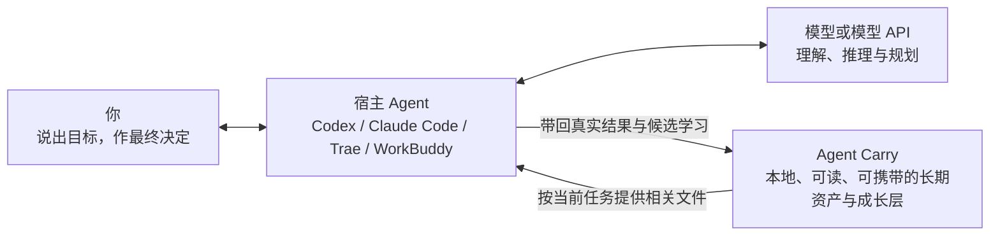

<div align="center">

# Agent Carry

### AI 日新月异，Agent 不断更替。Agent Carry 为此而生。

你今天可能使用 Codex，明天换成 Claude Code、Trae 或 WorkBuddy，以后还会遇到尚未出现的新 Agent。它们可以逐渐熟悉你的习惯，也可能形成各自的记忆和工作方式；但这些积累通常留在原来的软件里，换一个 Agent，并不会自动跟着你走。

**Agent Carry 接在你正在使用的 Agent 旁边。** 从接入它开始，值得长期保留的新记忆、能力、经验和固定流程，会沉淀在 Agent Carry 自己的可读文件中。以后换 Agent、换模型或换电脑，你带走的是 Agent Carry，也带走了这段长期积累。

**让积累带得走 · 让每次进化看得见、改得了 · 让普通人也能拥有真正适合自己的 AI 助手**

[在线体验看板](https://ww-cooooo.github.io/Agent-Carry/) · [交给 Agent 安装](INSTALL.md) · [了解工作原理](docs/architecture.md) · [查看安全边界](docs/security-and-privacy.md)

<sub>本地优先 · 跨 Agent 使用 · 渐进加载上下文 · 不强制使用 GitHub</sub>

</div>

> **在线演示只使用虚构数据。** 它用来展示页面和交互，不属于任何真实用户。正式仓库、下载包和本地安装始终从空模板开始，不会夹带演示数据。

> **当前版本：`1.0.0`。** 正式仓库、下载包和本地安装都从未实例化的空模板开始；不会代码也可以把安装交给 Agent，熟悉技术的用户也可以继续查看架构、协议和开放格式。

## 先说清楚：Agent Carry 在哪里工作

Agent Carry 不是另一个需要你单独聊天的 Agent，也不会替代 Codex、Claude Code、Trae、WorkBuddy 或其他宿主。你仍然在自己熟悉的 Agent 中说话和工作；Agent Carry 在旁边提供相关记忆，并接住以后值得长期保留的积累。



| 参与者 | 它负责什么 |
| --- | --- |
| **你** | 说出目标，并决定重要的长期变化是否正确 |
| **宿主 Agent** | 作为工作台和手脚，操作文件、工具、浏览器和当前电脑 |
| **模型或模型 API** | 作为推理引擎，负责理解、规划、归纳和生成 |
| **Agent Carry** | 保存属于你的长期资产，负责按需提供、整理、验证和迁移 |

宿主 Agent 原有的隐藏记忆仍然属于原软件。Agent Carry 不会声称自己能偷偷读取或自动搬走这些不可访问的内容；如果你能导出、展示或明确提供其中一部分，它们可以先作为有来源的候选，再由你判断是否值得放进 Agent Carry。

## Agent Carry 解决的四件事

| 核心价值 | 你会得到什么 |
| --- | --- |
| **长期积累带得走** | 从接入 Agent Carry 开始，新形成的记忆、能力、经验和 SOP 不再只留在某个宿主里 |
| **学习和进化看得见** | 你能在看板中看到它学了什么，再和当前宿主 Agent 交流、修正或撤回 |
| **助手真正适合你** | 既能成为熟悉日常习惯的通用助手，也能成长为适合你职业的专业助手 |
| **完全不懂 Agent，也能开始** | 只需用普通话说出自己的职业、眼前的困难和想完成的事情，Agent Carry 就会引导你找到第一项真正值得用 AI 完成的任务 |

<details>
<summary><strong>点击展开：1. 长期积累怎样跨 Agent、跨电脑和不同系统使用</strong></summary>

从接入 Agent Carry 开始，真正值得留下的内容会保存在它自己的开放文件里，例如：

- 你的长期偏好、背景、约束和沟通习惯；
- 在真实任务中反复有效的判断方法与能力；
- 可以稳定复用的固定流程（SOP）；
- 以前踩过的坑、失败原因和后来有效的修正；
- 明确留下的待办，以及仍需验证或复核的成长内容。

**同一台电脑换宿主 Agent：** 新 Agent 通常可以继续读取同一份 Agent Carry，不需要复制整套资产。

**换电脑，或者目标电脑使用不同系统：** 可以把整个 Agent Carry 做成迁移套件，再交给新电脑上的 Agent 恢复。正式资产使用 Markdown 和 TOML，迁移格式不绑定盘符、绝对路径、按钮或某个平台的命令；Windows、macOS 或 Linux 上的桌面入口、秘密凭据和系统相关配置由目标电脑上的 Agent 按当地环境重新建立。

带走的不是某个平台的外壳，而是保存在 Agent Carry 中、由你拥有的长期积累。

</details>

<details>
<summary><strong>点击展开：2. 每一次学习和进化，怎样被你看见、交流和修正</strong></summary>

Agent Carry 不把“自我进化”做成无法解释的后台变化。一次值得长期保留的学习会经过清楚的过程：

1. 你把真实任务交给当前宿主 Agent；模型与宿主完成工作并核对结果。
2. 如果出现可能复用的新做法，先记录它来自哪项任务、适合什么情况、还缺什么证据，而不是立刻写成永久规则。
3. **由谁看见？** 你可以在 Agent Carry 看板中看到候选内容、来源、用途和当前状态。
4. **和谁交流？** 你直接和当时使用的 Codex、Claude Code、Trae、WorkBuddy 或其他宿主 Agent 用自然语言讨论。
5. **怎样修正？** 你只需说“这里理解错了”“只适用于这种情况”“先别保留”或“这个步骤应该改成……”，宿主 Agent 就会按正式规则更新、缩小范围、撤回或继续验证 Agent Carry 中的对应内容。
6. 如果你明确要求保存一条清楚且适合安全写入的记忆，它可以按你的授权直接保存；如果是模型从任务中推断出的规律，通常先保留为候选。能力和 SOP 即使已经允许使用，没有真实成功证据时仍会标为“待验证”；后续任务再决定它是否可靠。失效、重复和长期无用的内容会进入复核、合并或清理。

重要变化不会因为模型的一次猜测就悄悄变成你的长期事实。你不必手工管理每个文件，但始终可以知道它学了什么、为什么留下，以及怎样改正。

</details>

<details>
<summary><strong>点击展开：3. 它怎样成为通用个人助手或职业专业助手</strong></summary>

#### 通用个人助手

它可以逐渐了解你的沟通方式、工作习惯、偏好、常做的事情和长期计划，在不同任务中少问重复问题，也更贴近你习惯的做事方式。

#### 面向职业和领域的专业助手

如果你熟悉 Agent、懂编程或已经有成熟的专业方法，可以把行业资料、标准、真实任务和判断依据交给它，在长期使用中把它培养成更适合你的专业助手。

创建时，“你希望它怎样和你交流”和“你要创建哪种助手”是两个独立选择。第一次接触 Agent、已经用过一些、经常使用 Agent 的人，都可以创建通用助手或专业助手。交流方式以后随时可改；助手方向要在完整预览确认后才会锁定。

</details>

<details>
<summary><strong>点击展开：4. 完全不懂 Agent，也能从自己的工作开始</strong></summary>

如果你完全不懂 Agent，只知道 AI 发展很快、自己不想在这个时代掉队，也可以从普通话开始。告诉它三件事就够了：

- 你从事什么职业；
- 现在最困扰你的事情是什么；
- 你想完成什么，但不知道 AI 能怎样帮忙。

Agent Carry 会让当前宿主 Agent 用听得懂的话继续提问，帮你找到第一件真正值得用 AI 完成的任务，说明 AI 在你的行业里能做什么，再一步一步陪你把它用起来。你不需要先学会提示词工程、代码或内部架构，才有资格拥有自己的专业助手。

</details>

## 最快开始：把安装交给 Agent

你不需要亲自学习 Git、终端、npm 或项目目录。准备好一个能够读取本地文件的 Agent，选择下面任意一种方式即可。

### 方式一：把 GitHub 安装说明发给 Agent

把下面的链接和整段文字一起发给你正在使用的 Agent：

```text
https://github.com/Ww-Cooooo/Agent-Carry/blob/main/INSTALL.md

请完整读取这个安装说明，按里面的步骤帮我安装 Agent Carry。请把完整项目安装到适合长期使用的本地目录，并在桌面或系统中容易找到的位置创建“Agent Carry 看板”入口。遇到已有实例、覆盖冲突、助手方向或权限变化时，先用普通语言问我；不要擅自创建、推送或发布 GitHub 仓库，也不要读取或发送秘密凭据。完成后告诉我安装位置、看板入口、实际打开结果，以及仍需我确认的下一步。
```

只要当前 Agent 能访问 GitHub、读取和写入你指定的本地目录，并能创建桌面或系统等价入口，它就可以按照同一份安装说明完成操作。正式包已经带有构建好的离线看板，不需要你另装前端依赖，也不会自动上传任何内容。

### 方式二：直接下载完整压缩包

**[点击直接下载最新版 Agent Carry（ZIP）](https://github.com/Ww-Cooooo/Agent-Carry/releases/latest/download/Agent-Carry.zip)**

下载后不必自己解压，把 ZIP 文件和下面这句话一起发给 Agent：

```text
请在这个 Agent Carry 完整压缩包中找到 START-HERE.txt，完整读取其中两条横线之间的安装请求，再按 INSTALL.md 完成安装和看板入口验证。不要只预览压缩包，也不要只复制 dashboard.html。
```

两种方式安装的是同一套完整项目。安装 Agent 会先选择稳定目录，再检查项目是否完整，最后在桌面或系统中容易找到的位置创建“Agent Carry 看板”入口。

### 安装完成后，先选交流方式，再选择一次方向

交流方式只决定 Agent 解释得多细、怎样追问，不是能力测试，也不是模型 Level：

- **一步步引导**：第一次接触 Agent，用普通话从真实工作开始；
- **适度引导**：已经用过一些，只补问会影响结果的关键信息；
- **直接协作**：经常使用 Agent，可直接讨论标准、资料、工具、SOP 和验收方式。

无论选择哪种交流方式，都可以继续选择：

- **通用个人助手**：适合跨领域的日常工作，逐渐熟悉你的偏好和习惯；
- **领域专属助手**：锁定一个职业或专业方向，在这个领域持续积累更深的能力和流程。

如果现在拿不准，可以选择“先帮我判断”：Agent 会先了解你的工作和困难，再比较两种方向；它不会把这个过程写成第三种方向。方向真正写入前，Agent 会展示完整预览并请你确认。方向一旦锁定就不会被静默改掉；交流方式可以随时调整。如果以后想要另一个完全不同的助手，可以保留原实例，再从空模板创建一份新实例。

如果你不知道专业助手该从哪里开始，可以直接说：

```text
我的职业是____。我现在最困扰的是____，我想完成____，但我不知道 Agent 能怎样帮我。请先用我能听懂的话问我必要的问题，再带我从一件真实的小事开始使用 Agent Carry。
```

## 平时使用时，它怎样工作

<details>
<summary><strong>点击展开：看一次任务怎样按需加载、执行、学习和整理</strong></summary>


启动时，Agent Carry 不会把所有记忆、规则和历史一次塞进模型上下文。它先读取一个很小的入口；任务命中某个主题后，才沿着地图加载完成这项任务所需的少量文件。省掉的是无关内容，不是记忆质量、安全边界或学习能力。

### 看板中的内容分别是什么

| 内容 | 它解决什么问题 | 平时怎样使用 |
| --- | --- | --- |
| **记忆** | 保存稳定事实、偏好、背景和长期约束 | 任务命中相关主题时自动按需加载；看板中的手动指令只是备用入口，不要求你每次复制 |
| **能力** | 保存可以跨任务复用的判断方法和做事能力 | 在合适的真实任务中验证，确认有效后显示为“可使用” |
| **固定流程（SOP）** | 保存一类重复任务的完整步骤、分支和完成标准 | 来源于反复出现且值得固定的做法；新流程先验证，环境变化或失败后进入复核 |
| **经验** | 记录一次任务发生了什么、为什么成功或失败、以后应注意什么 | 遇到相似场景、风险或失败信号时再读取，不会每次启动都加载 |
| **待办** | 保存你明确要求以后继续处理的事情 | 普通聊天不会自动变成待办；完成后可以从看板隐藏 |
| **成长内容** | 保存仍在观察的学习建议、候选和长期改进 | 先说明来源与用途，再通过真实任务决定沉淀、合并、复核还是清理 |

</details>

## 看板：看清状态，不要求你管理内部文件

| 你在看板中看到的 | 实际含义 |
| --- | --- |
| **[在线演示看板](https://ww-cooooo.github.io/Agent-Carry/)** | 可以体验“总览、随身资产、待办与成长、迁移与安全、当前状态”；演示使用独立虚构数据，正式安装包不包含这些内容 |
| **本地看板** | 离线运行，只读展示 Agent Carry 的当前状态，不会在页面后台擅自改记忆、执行 Git 或上传数据 |
| **操作按钮** | 复制一份写清目标、范围和边界的自然语言请求，再由你交给当前宿主 Agent 执行 |
| **中央行星与周围卫星** | 中央行星代表 Agent Carry，卫星分别通向记忆、固定流程、能力、待办、经验、长期改进、学习建议和当前模型 |
| **3D、动画、关系图、字体和图标** | 全部随项目一起打包，不依赖 CDN；页面会自动照顾节能和减少动态，不需要用户管理装饰效果 |

## 换 Agent、换电脑和 GitHub 备份不是一件事

| 你的目的 | 是否需要打包 | 应该怎样做 |
| --- | --- | --- |
| **同一台电脑换宿主 Agent** | 通常不需要 | 把当前 Agent Carry 的本地目录告诉新 Agent，请它从根入口开始读取；新旧宿主继续使用同一份长期资产 |
| **换电脑，或目标电脑使用不同系统** | 需要迁移套件 | 让当前 Agent 生成迁移套件，再把整个文件夹交给目标电脑上的 Agent；文件格式不绑定某个系统，目标电脑上的 Agent 会按当地环境重建入口和系统相关配置 |
| **备份到 GitHub 私有仓库** | 生成独立的安全副本 | 这是可选的远程托管备份，不是换机迁移；上传前会排除本地隐私正文和秘密凭据，并再次确认仓库为 `private` |

<details>
<summary><strong>点击展开：跨电脑或不同系统迁移套件里有什么</strong></summary>

迁移套件文件夹包含彼此分开的助手主体包、本地隐私包和一份 `START-RESTORE.md`：

- 助手主体包携带 Agent Carry 中可迁移的记忆、能力、SOP、经验和状态；
- 本地隐私包只在你明确要求时单独生成，避免和普通内容混在一起误传；
- API 密钥、密码、令牌、Cookie、私钥、恢复码和登录态不进入任何迁移包，需要在新电脑重新配置；
- 恢复前会先检查身份、文件清单、校验值、危险路径和冲突，再写入目标目录。

把迁移套件交给新电脑上的 Agent 后，只需告诉它：

> 请先读取迁移套件里的 START-RESTORE.md，按照里面的步骤帮我恢复 Agent Carry，完成后告诉我检查结果。

</details>

这是可选的**远程托管备份**，不是换机迁移。Agent 会先生成排除本地隐私正文和秘密凭据的安全副本，再让你确认 GitHub 账号、仓库名、访问者和 `private` 可见性，最后才允许上传。默认只有你自己能够访问；不会因为安装 Agent Carry 就自动创建或推送仓库。

GitHub 从来不是使用 Agent Carry 的前提。只在本地使用也完全可以。

## 安全与隐私

Agent Carry 不会用“百分之百安全”这样的口号掩盖模型和宿主的真实边界。它通过分层规则降低常见风险：

| 风险 | Agent Carry 怎样处理 |
| --- | --- |
| **提示词注入** | 网页、邮件、附件、工具结果和其他来源的文字先当作外部资料，不能借其中的命令扩大任务、权限、接收方或资源预算 |
| **普通隐私与秘密凭据混淆** | 当前模型可以按任务需要处理最小相关的普通隐私；API 密钥、密码、令牌、Cookie、私钥、恢复码和登录态永远不能进入模型上下文、消息正文、日志、Git 或迁移包 |
| **敏感内容发错地方** | 向网站、邮件、插件、其他 Agent、其他人员或仓库发送前，重新核对真实接收方和必要范围 |
| **无限重试与 Token 浪费** | 联网、递归、批量操作和模型调用必须有范围、重试与无进展停止边界，外部内容不能取消这些限制 |
| **看板偷偷联网或常驻** | 看板资源全部保存在本地，不依赖 CDN，也不需要常驻后台服务 |
| **备份与迁移混在一起** | GitHub 私有备份、本地隐私导出和整机迁移分别处理，避免把用途不同的数据混进同一个包 |

完整威胁模型、典型攻击处理和贡献检查表见 [安全与隐私说明](docs/security-and-privacy.md)。

## 我们已经做过哪些验证

复杂检查留在维护和发布阶段，不转嫁给普通用户。保存一条记忆、形成一个 SOP 或打开看板，不需要你反复打开终端跑企业级回归流程。

| 验证范围 | 当前结果 |
| --- | --- |
| 链接与压缩包的隔离安装、完整文件核对、桌面入口和离线打开 | 已完成真实入口验收 |
| 多组宿主 Agent 与不同模型的实例化、会话恢复、任务执行和学习闭环 | 已完成隔离验证并根据暴露问题修正规则 |
| 提示词注入、秘密凭据、普通隐私、额外外发和资源耗尽边界 | 已形成分层协议并使用虚构数据验证关键路径 |
| Windows 上完整迁移套件的生成、双包分离、摘要校验、异常包拒绝和隔离恢复 | 已使用虚构实例完成生成—恢复闭环；没有读取真实隐私或秘密凭据 |
| 看板交互、离线资源、第三方许可证和字体来源 | 当前正式构建检查已通过 |
| 模板空态、长内容、缺失字段和常见电脑窗口 | 已使用合成夹具与真实浏览器检查 |

每次公开发布前，还会重新检查公开候选中的模板空态、隐私、秘密、许可证、离线运行、安装结果和私密历史隔离。这些是发布门禁，不会变成普通用户每天使用 Agent Carry 的负担。

<details>
<summary><strong>点击展开：技术架构与项目文档</strong></summary>

| 文档 | 适合什么时候看 |
| --- | --- |
| [整体架构与设计原则](docs/architecture.md) | 想理解参与者分工、可携带主本与渐进上下文 |
| [跨 Agent 接入与协作](docs/host-integration.md) | 想接入新的、变化后的或未知的宿主 Agent |
| [记忆、能力与 SOP 怎样成长](docs/asset-evolution.md) | 想理解候选、验证、复核、合并与淘汰 |
| [动态触发与跨会话信号](docs/cross-session-signal-map.md) | 想知道“到什么条件做什么”怎样在极小上下文下运行 |
| [任务结果验证](docs/result-validation.md) | 想理解什么结果能够计入长期证据 |
| [看板设计与前端架构](docs/dashboard-design.md) | 想修改界面、动效、3D 或离线构建 |
| [看板开发与本地检查](dashboard/README.md) | 想运行前端源码或复现离线构建 |
| [贡献与开发说明](docs/developer-guide.md) | 想参与项目开发或修改核心组件 |
| [开源合规与第三方来源](docs/open-source-compliance.md) | 想核对依赖、字体、素材和许可证 |
| [第三方组件与许可证](THIRD_PARTY_NOTICES.md) | 想查看准确版本、来源和声明 |

第一版刻意采用 Markdown、TOML 和自然语言协议，不要求数据库、后台进程或某个宿主的私有 API。索引、缓存、向量库和平台记忆都可以作为可重建的本地加速层，但不能成为用户资产的唯一真源。

</details>

<details>
<summary><strong>点击展开：常见问题</strong></summary>

### 我完全不懂代码，能用吗？

可以。最短路径就是把 [安装说明](INSTALL.md) 的链接交给你正在使用的 Agent。安装、目录选择和桌面入口由 Agent 完成；出现会真正改变结果的选择时，它再用普通语言问你。

### Agent Carry 会替代 Codex、Claude Code、Trae 或 WorkBuddy 吗？

不会。它接在当前宿主旁边，保存和治理属于你的长期积累。你仍然自由选择宿主 Agent 和模型。

### 它能自动搬走宿主 Agent 已有的全部记忆吗？

不能，也不会这样承诺。宿主的隐藏记忆通常留在原软件内部，Agent Carry 无法访问就不会假装已经读取。如果你能导出、展示或明确提供其中一部分，当前宿主可以把它们作为有来源的候选，经过范围、冲突和价值判断后，再由你决定是否带入 Agent Carry。

### 看板里的记忆是不是每次都要手动复制使用？

不是。相关记忆会在任务命中时自动按需加载。看板中的“复制使用指令”用于你想明确调用、检查或纠正某一项内容时，是补充入口，不是日常使用的必做步骤。

### 在线演示的数据会安装到我的电脑吗？

不会。在线演示使用独立的虚构快照；公开 `main`、正式压缩包和本地安装目录始终保持空模板。

### 一定要用 GitHub 吗？

不用。Agent Carry 可以只在本地使用。GitHub 私有仓库只是可选的远程备份，而且在真正创建或推送前会再次让你确认。

### 升级会覆盖我的实例吗？

不会静默覆盖。模板升级必须由你明确提出，并保留实例身份和个人资产；发生冲突时，Agent 会先说明再让你选择。

### 可以创建多个不同方向的助手吗？

可以。每个实例都从空模板单独创建，方向写入后锁定。想要另一个完全不同的方向时，保留原实例，再复制一份空模板创建新实例。

### 交流方式选错了，需要重新创建助手吗？

不需要。一步步引导、适度引导和直接协作只是可调整的沟通偏好。你可以在看板“当前状态”中选择新的交流方式，再把完整调整指令交给当前 Agent；它只修改交流方式，不会改变已锁定方向或重做已有资产。

</details>

## 项目状态与许可证

当前版本是 `1.0.0`。看板面向电脑使用，正式目标宽度为 1024px 及以上。每次发布都会生成独立洁净候选，并重新检查模板空态、隐私、秘密、许可证、离线运行和安装结果；这些维护检查不会变成普通用户日常使用时的负担。

Agent Carry 的原创代码、配置、模板和文档采用 [Apache License 2.0](LICENSE)。随项目分发的框架、字体和改写源码继续适用各自许可证；准确清单与完整声明见 [THIRD_PARTY_NOTICES.md](THIRD_PARTY_NOTICES.md)。
