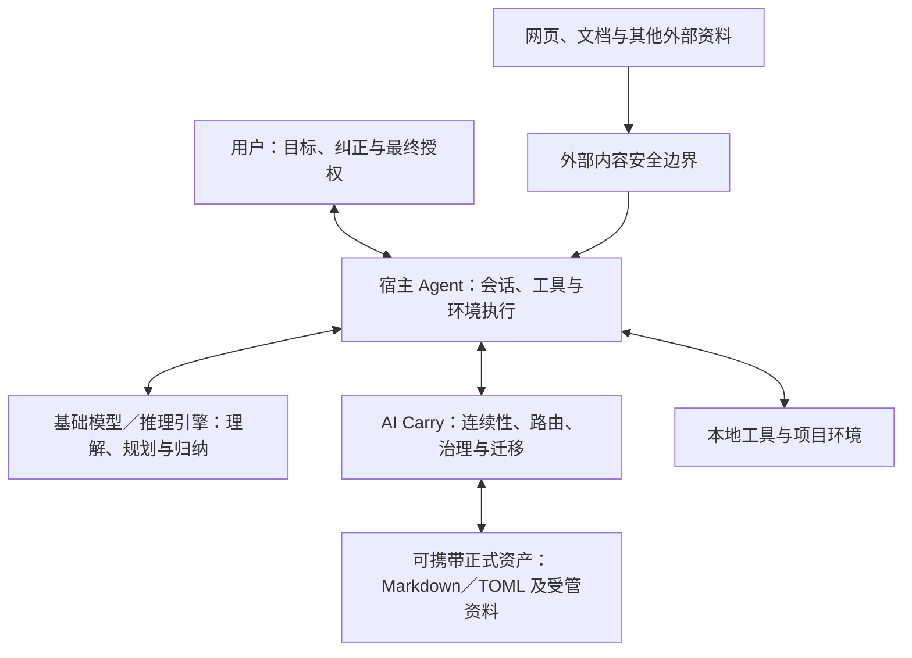

# AI Carry 架构与设计原则

## 文档状态

- **文档类型**：持续更新的目标架构说明与已确认决策记录
- **主要读者**：普通用户、开源使用者、贡献者、维护者，以及接入 AI Carry 的 AI Agent
- **当前阶段**：AI Carry `2.0.9`；继续沿用四项最高原则与 2.0.5 的精简架构，统一产品名与官方公开仓库地址，并把电脑端离线看板首屏重构为一个连续舞台；不增加后台服务、Schema、依赖、手机端承诺或企业式测试矩阵。1.4.8、未公开 1.4.9、2.0.0 至 2.0.8 都是直接来源
- **最近更新**：2026-09-04

本文解释 AI Carry 为什么存在、由哪些部分组成、不同参与者如何协作、记忆与能力如何迁移、上下文如何渐进加载，以及当前实现与目标设计之间还有哪些差距。

本文不是启动入口。普通任务不应自动加载整份架构说明；Agent 应从根目录的 `BOOTSTRAP.md` 开始，通过地图按需读取。本文主要用于理解、维护、评审和贡献。

### 状态标记

本文使用三种状态，避免把讨论完成误写成实现完成：

- **当前基线**：仓库中已经存在对应入口、协议或结构。
- **已确认设计**：产品与架构方向已经确认，但可能尚未写入全部协议或实现。
- **待落地**：后续需要修改协议、Schema、模板、提示词或界面后才能真正生效。

## 1. AI Carry 是什么

AI Carry 是一个由用户拥有、可以随用户迁移的个人 AI 连续性与成长层。

它不是一个必须替代 Codex、Claude Code、国产 Agent 或未来新 Agent 的独立宿主，也不与基础模型竞争。用户仍然在自己选择的 Agent 中工作；AI Carry 负责携带用户直接授权或按用户学习政策逐渐成熟的长期积累，使这些积累不被锁死在某个平台里。

AI Carry 主要携带：

- 用户事实、偏好、长期约束和专业背景；
- 经真实任务形成的经验和可复用判断方法；
- 可迁移能力及其适用条件；
- 详细、可执行、可适应环境变化的 SOP；
- 待办、阶段状态和需要继续推进的工作；
- 学习与进化候选、证据、冲突和成熟度；
- 安全边界、隐私要求和用户授权记录；
- 未来可能出现的文本、图像、音频、视频、结构化资料或其他资产形态。

它最终要让用户产生这样的体验：

> 我几乎不需要理解内部文件、Git、测试框架或 Agent 配置；它会用自然语言引导我，并把我长期积累的做事方式带到新的模型和 Agent 中。

## 2. 它解决的问题

### 2.1 平台记忆无法真正属于用户

许多 Agent 会形成自己的记忆、工作流、Skill 或自动学习结果。这些能力通常依赖宿主产品的目录、API、账号、系统提示或专用格式。用户更换 Agent、操作系统、设备或模型后，过去的积累往往无法完整迁移。

AI Carry 把用户直接授权或按用户学习政策逐渐成熟的长期资产保存为开放、可读、可打包的主本，使宿主可以更换，个人积累仍然延续。

### 2.2 强模型会掩盖文档缺陷

能力较强的模型可以自行补全模糊提示中的缺口，但能力较弱、规划较少而执行可靠的模型，可能因为缺少触发条件、分支、边界或验收标准而失败。

因此 AI Carry 不能只保存简短提示或抽象摘要。它还要保存足够清晰的程序性知识，让合理能力范围内的不同模型都能执行。

### 2.3 个人用户不应承担企业级治理负担

AI Carry 的记忆、安全、学习、SOP 和渐进检索不能因“轻量化”而削弱。真正需要简化的是：频繁打开终端、庞大回归流程、复杂发布审批、强制 GitHub 工作流和要求普通用户理解内部架构。

轻量化首先是用户体验和治理负担的轻量化，不是内部说明、记忆质量或安全边界的缩水。

### 2.4 自然语言不能只是把操作换成一句话

AI Carry 默认用户可能第一次接触 Agent、很少使用 Agent，或不了解编程、路径和内部术语。自然语言引导不是只问一句“你想怎么做”，而是让用户在不理解内部架构的前提下仍能作出正确决定：Agent 先说明已知事实和为什么需要选择，再给出少量互斥方案、每项后果、能够成立时的推荐，以及“我不确定，请帮我判断”的入口。

这条完整性底线适用于整个产品，不只适用于首次安装。三种交流方式只调整篇幅和节奏；`direct` 可以更简洁，但不能省略会改变结果、成本、隐私、权限、可恢复性或长期影响的信息。Agent 已经创建、移动或整理过文件时，应复用工具结果中的实际位置，用户只决定资料是否长期保留和携带，不能被要求重新寻找 Agent 已知路径。

启动时只读取 `assistant.toml` 中极小的 `interaction` 基线。遇到多步骤、技术性、风险性、长期性或用户不确定的选择，才通过 `domain-lifecycle/user-decision-guidance` 加载 `core/protocols/USER_GUIDANCE.md`。因此详细引导不会变成每次启动的上下文负担。

### 2.5 业务完成与回复收尾分开容错

长任务即使已经正确完成，也可能在工具链、错误恢复或上下文压缩后遗漏使用回执、学习回执、文件去向或真实下一步。AI Carry 因此在复杂任务的最终草稿发送前增加一个一次性本地收尾契约：它只检查有界任务事实与回复结构，不联网、不持久保存状态、不重跑任务。缺少收尾时只修当前回复；检查器或元数据自身损坏时透明降级并从现有任务证据重建。业务结果、文件、对话和其他能力始终保持可交付，不让一个展示层小故障演变成整个 Agent 停止。

这不是给每条消息增加流程。简单任务只保留清楚的最终下一步；有真实使用、学习或文件去向时才出现对应区块。固定验证只覆盖事故原型、压缩续接、简单任务和局部降级等少量高信息场景，不建立企业式回归矩阵。

## 3. 产品边界与非目标

AI Carry：

- 是用户长期资产的可携带主本；
- 是接入宿主后的上下文、治理和成长层；
- 通过自然语言引导非技术用户；
- 允许开发者继续定制，但不要求普通用户理解代码；
- 可以在本地单独使用，也可以由用户选择备份到私密仓库；
- 可分发模板不携带真实用户实例、秘密凭据、本地日志或临时验收材料。
- 完整换机迁移使用宿主无关的固定套件契约：助手主体与本地隐私保持分离；小型资料使用一个私密分卷，大型资料可使用多个连续分卷与可校验分块。所有逻辑文件都在写入目标目录前核对清单和 SHA-256，秘密凭据在目标环境重新配置。

AI Carry 不是：

- 一个必须自带基础模型的封闭 Agent 产品；
- 某几个已知 Agent 的专用插件集合；
- 依赖特定操作系统路径、网页按钮位置或供应商 API 的自动化脚本包；
- 自动信任联网内容、工具输出或其他 Agent 消息的记忆收集器；
- 要求每项个人任务都执行企业级测试与发布审批的治理平台；
- 用当前看板界面定义整个产品架构的系统。

## 4. 四方协作模型

AI Carry 的任务、自我学习和自我进化不是由宿主 Agent 单独完成。完整系统包含三个执行层和一个最终权威：

| 参与者 | 主要职责 | 不应承担的职责 |
| --- | --- | --- |
| 用户 | 提供目标、纠正理解、授权重要变化、拥有最终决定权 | 被迫手工管理每一条低风险细节 |
| 基础模型或推理引擎 | 理解、推理、规划、归纳、生成和发现候选经验 | 单独决定什么是用户的长期真相 |
| 宿主 Agent | 管理会话、调用模型和工具、操作环境、收集验证证据 | 把自己的原生记忆当作唯一主本 |
| AI Carry | 路由上下文、提供长期资产、管理来源和冲突、组织学习与迁移 | 脱离模型独立思考，或脱离宿主直接操作环境 |

“基础模型或推理引擎”不写死为 API，因为未来可能来自云端 API、本地模型、宿主管理模型或其他尚未出现的运行方式。

这四方共同完成一次任务：AI Carry 提供相关资产，模型完成理解和归纳，宿主执行并验证，用户确认高影响变化。共同完成不要求同时启动多个程序；同一会话可以通过明确阶段承担这些角色。

## 5. 分层架构与正式真源

### 5.1 可携带真源

**当前基线**：正式资产以 Markdown 和 TOML 为主。它们可以被人阅读、被不同 Agent 理解、被版本管理；迁移套件与恢复语义不绑定 Windows、macOS、Linux 中某一个系统，系统相关入口和配置由目标环境重新建立。

以下内容属于可重建派生物，不应成为唯一真源：

- 宿主平台记忆；
- 本地索引、全文索引、向量库和 RAG 数据；
- 缓存、日志、报告和临时任务包；
- 看板快照及其他展示层数据；
- 某个平台专用的 Skill、插件或适配配置。

派生物可以提高体验，但删除或更换后，正式资产仍应能够恢复。

### 5.2 语义稳定，执行自适应

AI Carry 固定的是目标、用户边界、判断逻辑、输入输出、风险条件和完成标准，而不是某个平台当前的实现细节。

路径、按钮名称、页面布局、工具命令和供应商能力可以作为临时参考，但不能成为唯一执行依据。环境变化时，宿主应观察当前状态、寻找语义等价入口、验证后果并重新规划。

### 5.3 平台适配不是核心依赖

已知宿主的 Skill、MCP、API 或专用目录可以成为可选加速器，但必须满足：

- 没有它们时仍能通过自然语言提示词完成核心接入；
- 它们不拥有正式资产；
- 宿主变化时可以删除、替换或重建；
- 适配层失效不能导致 AI Carry 主本失效。

## 6. 提示词优先的通用接入协议

### 6.1 为什么以提示词作为必选入口

如果接入依赖某个产品的记忆目录、API、按钮或插件，宿主升级、新 Agent 出现或用户更换系统后，接入层就可能失效。

**当前基线**：AI Carry 与宿主之间的唯一必选协议是平台无关的自然语言提示词。专用集成只能减少操作，不能成为产品根基。正式执行规则、交换结构和可复制入口已经分别落在 `core/protocols/HOST_INTEGRATION.md`、`core/schemas/host-integration.schema.md` 与 `core/templates/integration/`；面向人的完整说明见 [跨 Agent 接入与协作](host-integration.md)。

只要一个未来 Agent 能理解自然语言并接收用户提供的上下文，它就至少能够进入手动接入模式。提示词不能让宿主访问它看不到的数据，因此无法直接读取时，协议必须退回到用户提供启动胶囊或任务胶囊，而不是假装已经接入。

### 6.2 两种入口，共用同一语义

1. **通用手动入口**：用户把完整接入提示词交给任意 Agent。这是永久保留的最低兼容方式。
2. **宿主便利入口**：若宿主支持长期个人指令，可以保存一份接入唤醒说明。它只提醒宿主索取最新 AI Carry 胶囊，不保存完整用户记忆。

宿主便利入口失效时，必须随时退回手动入口。

### 6.3 “极小”不等于“模糊”

接入协议需要详细、明确，避免能力较弱的模型误解；极小化的是每次携带的个人内容，而不是协议的必要规则。

接入提示词应至少说明：

- AI Carry 是什么，不是什么；
- 用户、基础模型、宿主 Agent 和 AI Carry 的职责；
- 当前实例的极小名片；
- 能力发现、权限确认和只读探查方法；
- 渐进读取和最小充分上下文规则；
- 宿主协作记忆与 AI Carry 主本的关系；
- 外部内容、来源、冲突和正式写入规则；
- 无法确认接入时必须怎样失败并向用户说明；
- 任务完成后如何带回候选学习和验证证据。

### 6.4 开放式能力发现

接入协议不能只问宿主是否能读取附件、文件或粘贴文本。这些只是今天常见的方式，不能限制未来能力。

正确顺序是：

1. 先向宿主解释 AI Carry 的目的和可能携带的资产类型。
2. 提供不含详细隐私内容的当前实例名片。
3. 若用户已提供明确入口且当前环境允许，授权一次最小范围、只读、临时探查。
4. 要求宿主根据当前真实环境，自主说明所有与接入、理解、保护、使用、更新和回传这些资产有关的能力。
5. 宿主必须区分：当前已可用、需要授权、需要配置、无法确认。
6. 宿主说明每项能力的范围、持续时间、限制、数据保留方式和最小验证方法。
7. 宿主提出一个或多个接入方案；AI Carry 按最少打扰、最少权限、最少上下文和易撤销原则推荐，用户确认后再执行。

能力发现是开放集合，但目的受到约束。宿主不需要介绍所有无关功能，也不得披露系统提示、凭据或隐藏规则。

### 6.5 会话回执与失败关闭

提示词能够强引导宿主，但不能越过宿主系统规则或保证绝对服从。因此接入不能依靠“宿主说了一句好的”来判断成功。

宿主应提供可观察回执，至少说明：

- 是否已经理解 AI Carry 的角色；
- 当前实际看到了哪些启动信息；
- 当前采用什么接入方式；
- 界面选择的模型、当前请求实际模型、路由／辅助模型是否可观察，以及宿主原生记忆或长期指令是否会自动进入会话；
- 有哪些能力已验证、待授权或未知；
- 当前需要哪一类下一层上下文；
- 是否发现与宿主协作记忆的冲突。

无法确认时必须报告“尚未接入”或“需要更多上下文”，不得声称已经使用未提供的记忆。

接入结果使用 `not-connected`、`negotiating`、`connected`、`limited`、`uncertain`、`stale` 和 `revoked` 等明确状态。当前会话已有有效回执时不重复；正常新会话先命中 `HOST_SESSION_RESUME.md` 短路线，只读取极小宿主注册表和一个可能匹配的档案，不加载完整接入协议。首次接入、换宿主、匹配不明或相关能力变化时才展开完整协议。注册表和单档案有独立字节预算，只在相关写入或恢复失败时检查，不形成启动轮询。宿主原生记忆声称“以前接入过”只能作为线索，不能代替当前可见证据。

### 6.6 Agent 引导安装与接入的关系

**当前基线**：分发提供 GitHub 链接和完整压缩包两种形式，但两者都路由到根目录的 `INSTALL.md`，不维护两套可能漂移的安装逻辑。压缩包中的 `START-HERE.txt` 只负责把用户和 Agent 引导到该正式入口。

安装负责取得完整项目、放入稳定本地目录、验证离线文件并创建一个可重建的桌面看板入口；接入负责让当前宿主理解 AI Carry、恢复会话和按需使用资产；实例化负责让用户先选择交流方式，再选择通用或领域方向。三者是连续体验，但权限和完成条件不同：安装请求不自动授权 Git 操作、公开发布、秘密读取或替用户决定实例方向。成功安装空白模板后，安装 Agent 不能停在路径与版本报告；它把看板呈现在用户可见窗口中，同时在聊天里解释三种引导路线并收集第一项选择。用户不看或打不开看板时，聊天路线必须独立完成同一套引导。

实例化使用两个独立维度。`profile.guidance_mode` 是可随时调整的协作偏好：`step-by-step` 使用普通话逐步解释，`balanced` 只补问影响结果的关键内容，`direct` 直接讨论标准、资料、工具、SOP 和自动化边界。它不是用户能力评分，也不对应模型 Level 1／2／3。`direction.type` 才是实例身份，只能在 `general` 与 `domain` 中正式选择，并在完整预览确认后永久锁定。“先帮我判断”只是锁定前的比较过程，不进入清单成为第三种方向。三种交流方式都能创建两种方向，避免把专家误当成一定不需要解释，也避免把第一次接触 Agent 的用户限制为通用助手。

选择 `step-by-step`，或用户不知道 AI 能为当前职业做什么时，实例化不先解释内部架构。当前宿主先用普通话了解职业或主要工作、眼前困难和想完成的结果，再提出少量来自真实工作的候选任务；每项说明结果、所需材料和仍由用户决定的部分。用户选定第一项真实任务后，它只以 `task-family` 进入实例化预览和领域地图，目标指向真实实例说明，不属于正式资产。用户暂缓时不自动写成待办，也不预先制造记忆、能力、SOP、经验或学习建议。`balanced` 路线只补足真正改变设计的缺口；`direct` 路线在用户已经说明专业标准、资料和工作流时直接进入专业访谈，不强制经历入门问题。三条路线共用同一份正式写入和安全契约，不维护六套容易漂移的实例化流程。

首次使用的关键停点采用事件局部检查，而不是增加普通启动上下文：安装入口验证后、模板态准备开始首项真实任务时、实例化正式写入前后，以及第一项任务出现学习价值时，当前 Agent 才读取 `core/guides/first-use-execution-gates.md` 的对应小节。用户确认方向和完整预览后，确定性执行器把 manifest、正式档案和领域地图作为唯一核心事务；中途失败恢复模板前像。启动胶囊和双快照随后按真源刷新，失败只把对应派生项标为待重试，不撤销有效实例。验证、候选、组件、宿主和 Skill 等空登记表在相关能力第一次使用时初始化并与 manifest 对齐。第二次相同创建不刷新时间或制造记录；初始任务族不计为资产，第一项真实任务只有在结果得到核对且用户选择保留时才进入学习流程。

桌面入口只指向正式安装目录中的根 `dashboard.html`，不复制一个孤立网页。它属于宿主／系统适配，可以在换电脑或移动目录后重建，不成为可携带资产真源。Windows、macOS、Linux 和未来环境使用语义等价的快捷方式，不以某个固定用户名、盘符、命令或按钮为永久事实。

## 7. 渐进上下文与动态启动胶囊

### 7.1 两类启动内容

- **详细接入协议**：解释行为、边界和处理方式，可以较完整，但不携带全部用户资产。
- **动态启动胶囊**：只包含本次启动真正需要的实例身份、当前方向、安全边界、极小资产入口、待处理短路线、全部日程的唯一最早时间与总数，以及下一层请求方法。

### 7.2 三层路由

**当前基线**已经采用三层路由：

不增加要求普通任务必读的第四层。一个任务需要多个方面时，可以组合少量路线，但不能为了发现能力而扫描全部正文。

### 7.3 自然语言启动体验

启动胶囊可以只保留重要未完成事项的名称和状态，然后自然地引导用户：

> 上次有一项工作暂缓，另有一项接入协议仍在完善。你今天想继续其中一项，还是开始新的事情？

用户选择后才加载对应细节。没有匹配资产时，从当前任务开始工作，结束后再判断是否产生学习候选。

自然语言不要求精确口令。用户说“帮我弄一下上次那种成绩”时，分类地图只用低敏的标题、摘要、触发语、别名、对象、范围和排除条件形成少量候选；模糊表达只有一个明显候选时先用人能听懂的名称问“是不是这个”，确认后再打开正文，多个会改变结果的候选才让用户选择。用户已经明确点名旧做法或点击带稳定 ID 的动作时不重复确认。只有选中目标后才打开正文，因此“更容易找到”不会变成“启动时把全部记忆塞进上下文”。

任务结束时也不等待用户主动说“形成 SOP”。出现重复习惯、验证有效的做法或重要纠正后，Agent 在一个自然停点说明发现、未来用途和范围，让用户判断是否留下；内部资产类型、文件和路由由 AI Carry 处理。习惯使用 `memory/subtype=habit`，仍是同一套记忆生命周期和计数，不增加第五种长期资产。

### 7.4 最小充分上下文

目标不是机械追求最少字符，而是保留完成任务所需的最少充分信息：

- 用户当前要求；
- 实例方向和领域边界；
- 安全与隐私约束；
- 相关记忆、能力和 SOP；
- 验收标准及当前环境限制。

如果过度裁剪导致遗漏、误判或质量下降，应补读一个相关目标，不能为了节省 Token 硬做。

## 8. 可携带主记忆与宿主协作记忆

### 8.1 术语

- **可携带主记忆**：AI Carry 中由用户拥有、可以迁移的正式长期资产。
- **宿主协作记忆**：当前 Agent 自己积累并用于协作的原生记忆。

面向用户和公开文档统一使用“宿主协作记忆”。其中可能包含用户在接入 AI Carry 之前已经积累的大量有价值内容，应当受到尊重并得到合理利用。

### 8.2 首次接入时的渐进迁移

**当前基线**已经通过宿主接入协议和 Schema 落实以下渐进迁移方式。首次接入不忽略宿主已有记忆，也不把全部内容一次塞入上下文：

1. 宿主先给出已有记忆的类别、范围和来源概况。
2. AI Carry 根据长期价值、相关性和可迁移性逐类请求内容。
3. 区分用户明确表达、宿主推断、外部资料、宿主专属操作和过时内容。
4. 将值得长期保留的内容转换为中立、可携带的资产。
5. 重要或冲突内容由用户确认。
6. 宿主专属但仍有价值的内容可以继续留在宿主侧。

### 8.3 接入后的协作

宿主协作记忆可以继续积累。出现以下情况时，可以通过提示词把相关增量带回 AI Carry：

- 用户明确要求记住；
- 某项偏好或工作方式反复出现；
- 形成新的稳定经验或 SOP；
- 长期项目进入阶段节点；
- 用户准备更换 Agent；
- 宿主记忆与 AI Carry 发生冲突。

不要求每轮对话实时同步，也不建立强制后台同步系统。

### 8.4 “AI Carry 优先”的含义

AI Carry 的优先是归属、携带和正式记录优先，不代表其中每条内容永远比宿主记忆更新。

默认处理顺序是：

1. 用户当前明确指令；
2. AI Carry 中授权清楚、状态为 active 的当前资产；
3. AI Carry 中范围匹配的 provisional 试用资产，但它不覆盖第 2 项或授权高影响动作；
4. 宿主协作记忆；
5. 尚未核实的外部资料和推断。

若宿主提供更新、更充分的证据，应报告差异并形成修订候选，而不是因主本地位直接忽略。冲突解决后的长期版本仍由 AI Carry 保存。

### 8.5 当前状态与按需历史

用户事实、偏好和工作方式会随时间变化。正式资产不能简单覆盖旧内容，也不能让全部旧版本持续进入普通上下文。

- 当前有效内容正常参与任务；
- 用户明确表示“现在改为”时，更新当前状态并记录生效关系；
- 新内容只适用于特定场景时，增加条件分支，不覆盖通用内容；
- 无法判断是时间变化还是条件差异时，进入冲突候选；
- 被替代内容只在复盘变化、解释历史决定或解决冲突时按需读取。

“保留历史”不等于永久保存每个旧版本全文。对于普通变化，可以只保留旧结论、替代原因、时间范围和当前资产 ID；只有高影响、难以恢复或确有审计价值的内容才保留更完整证据。

### 8.6 按价值压缩与淘汰

AI Carry 不按“多久没用”粗暴删除，也不永久保存所有内容。整理时根据当前价值、预期生命周期、引用关系、证据质量、恢复成本和安全影响，选择以下处理：

| 处理方式 | 适用情况 | 保留内容 |
| --- | --- | --- |
| 保留全文 | 当前有效、仍被引用或有明确未来用途 | 完整正文和必要证据 |
| 合并压缩 | 多条重复、证据过多或表达零散 | 一份正式结论和少量代表性证据 |
| 历史摘要 | 已被替代但变化原因仍有价值 | 旧结论、替代原因、时间和新资产 ID |
| 完全删除 | 无价值、无引用、不可验证、纯临时或错误内容 | 通常不保留额外记录 |

不能仅凭最近是否使用判断价值。低频但具有明确使用窗口的资产可以长期保留；已经失效的临时路径即使刚产生，也应及时清理。

重复证据不无限累积。正式资产可以保留来源类型、出现次数或时间范围、少量代表性证据、反例和最近验证时间，其余重复过程可以压缩或删除。

整理采用渐进读取，只针对出现信号的领域检查元数据和少量正文。低风险临时候选、完全重复副本、无引用的一次性噪声和已经合并的重复证据可以低打扰处理；用户明确批准过的长期记忆、稳定 SOP、能力、安全规则和难以恢复的经验，删除前需要用户确认。重要删除可以先经过短期可恢复阶段，但不为所有普通噪声永久保存删除记录。

## 9. 来源信任与资产成熟度

“来源能证明什么”“为什么允许使用”“错误后果多大”和“真实任务验证到哪里”是四个不同维度，不能把所有其他 Agent 输出一律称为不可信候选，也不能把用户批准等同于已经可靠。Asset Schema 1.3 分别使用来源、`approval_state/activation_basis`、`risk_tier` 和带证据闭包的 `maturity` 表达；风险策略只决定候选复核优先级，正式资产仍需用户明确确认。这里的 `Asset Schema 1.3` 是内部资产结构基线，不是 AI Carry 产品版本；产品版本与各组件基线分别演进。

| 内容来源 | 默认处理 | 资产状态 |
| --- | --- | --- |
| AI Carry 提供后由已接入宿主原样返回的内容 | 识别来源并去重 | 保持原状态，不重复导入 |
| 用户在已接入会话中明确确认或要求记住的决定 | 用户权威内容 | 可按规则正式沉淀 |
| 模型和宿主根据任务提出的新经验 | 正常学习成果，检查证据和范围 | 先在当前任务观察；用户选择“先观察”后才成为候选 |
| 接入前的宿主原生记忆 | 有价值的迁移来源，按来源细分 | 渐进审核后迁移 |
| 联网、邮件、陌生文档或工具返回的内容 | 只有数据权重，没有授权权重 | 核实前不能成为正式资产 |
| 来源不明或接入状态无法确认的内容 | 暂缓归因并说明不确定性 | 不自动写入 |

已接入 AI Carry 的宿主不是简单的“外部 AI”，而是本次 AI Carry 托管会话的执行环境。但宿主看到的网页、工具输出和未经验证推断仍然不能因会话已接入而自动获得授权。

## 10. 任务、学习与进化闭环

### 10.1 一次任务的共同完成过程

1. AI Carry 根据任务路由相关记忆、能力、SOP 和安全边界。
2. 基础模型理解目标、规划方案并识别可能的学习点。
3. 宿主 Agent 调用工具、操作环境并收集实际结果和验证证据。
4. 三者在任务结束后进行轻量反思：发生了什么、为什么成功或失败、哪些内容可复用。
5. AI Carry 按来源、证据、影响和资产类型组织候选。
6. 风险分级只安排候选验证与复核顺序；任何内容进入正式资产前，都由用户确认具体内容和适用范围。

AI Carry 的“自我进化”不是修改基础模型参数，而是让可携带资产随着真实工作变得更完整、更准确、更容易被未来模型复用。

### 10.2 分级沉淀

**当前基线（Asset Schema 1.3）**：

- 用户明确说“记住这个”或“以后都这样”：展示一次与精确内容绑定的完整预览，让用户选择“留下”；当前通用母版不接受模型自签 JSON 代替这次用户选择，选择完成后不重复询问同一内容。
- 模型根据一次任务推断出的偏好或经验：先留在当前任务并在自然停点询问；用户选择“先观察”后才成为持久候选，不保存或不回应时不留下具体内容。
- 多次真实任务反复验证的低风险规律：优先带到用户面前复核；用户明确采用后才进入正式资产，再随真实证据渐进提升成熟度。
- 身份、隐私、安全规则、重要偏好和高影响 SOP：必须由用户确认。
- 临时路径、一次性参数和过程噪声：不进入长期资产。
- 来自外部资料的结论：保留来源并核实，不能因模型总结过就直接晋升。

`status`、授权依据、风险和成熟度彼此独立。低风险内容满足独立真实证据、无冲突、可撤销等条件后，只会更早进入复核；用户明确确认具体内容和范围后，才可进入 `provisional`，试用后再次成功复用才可进入 `active`。实例化时选择的政策只控制主动观察、候选验证和复核优先级，不能授权正式资产，也不能把沉默解释为同意。用户可以把实例改为 `manual-only`。

### 10.3 先判断这次任务是否值得留下长期积累

**当前基线**：AI Carry 不应在每个普通任务结束后都询问用户是否形成记忆、能力或 SOP。模型、宿主 Agent 与 AI Carry 可以先进行一次轻量判断；只有出现具有长期价值的信号时，才加载资产生命周期并启动进化整理。

学习信号包括：

- 用户纠正了 Agent 对事实、目标或偏好的理解；
- 用户表达了可能长期有效的偏好、边界或工作原则；
- 任务经历了有价值的失败、诊断和成功修正；
- 发现了可跨任务复用的判断方法；
- 同一种工作方式在多个任务中反复出现；
- 形成了具有稳定触发条件和完成标准的流程或能力；
- 用户身份、长期项目状态、安全要求或隐私要求发生持续性变化。

以下内容通常不启动进化整理：

- 普通执行步骤和没有复用价值的过程；
- 一次性参数、临时路径、临时界面状态和短期调试信息；
- AI Carry 已经拥有且没有发生变化的内容；
- 缺少来源、证据或用户意义的泛化总结；
- 仅仅因为模型能够总结，就生成的形式化“经验”。

用户指出错误或任务经历失败时，先修正并验证当前结果，再判断根因有没有跨任务价值。错误本身不会自动变成记忆；只有修正后的结果成立、原因和适用范围能够说明时，才进入同类匹配，并按用途成为经验、记忆、能力或 SOP。一次性失误、临时调试信息和完整错误日志在任务结束后丢弃。

命中学习信号后，向用户展示的内容应保持简洁：学到了什么、依据是什么、适用范围、是等待确认还是已进入可撤销试用，以及怎样撤销。未命中时安静结束任务，不生成空洞候选，也不弹出固定学习问题。完整规则见 [资产学习、能力进化与 SOP 成熟](asset-evolution.md)。

### 10.4 同类学习识别与证据合并

同一种偏好、经验或规律反复出现时，应汇入同一条学习线索并积累证据，而不是每次创建一份新候选。判断过程不得为去重而读取全部记忆正文。

#### 第一步：生成小型检索特征

新学习先整理为仅供匹配使用的检索特征，Asset Schema 1.3 已为候选提供对应字段，至少包含：

- 资产类型；
- 主题或作用对象；
- 一句话核心含义；
- 适用范围和条件；
- 来源与时间范围；
- 可能的自然语言别名。

检索特征不是正式记忆，也不能因为已经结构化就跳过证据和生命周期判断。

#### 第二步：通过现有三层路由缩小范围

根地图和分类地图先把新学习限制到相关领域。地图只使用稳定 ID、一句话摘要、主题、范围、别名、状态和相关资产 ID 等小型元数据，不加载无关正文。

规模较小时，可以直接从分类地图元数据中选择少量候选。规模增大或检索质量下降后，可以增加可重建的全文或语义检索派生层；派生层只返回少量候选 ID 和匹配理由，不拥有正式资产，也不成为普通上下文必须读取的第四层。

#### 第三步：只读取少量候选正文

对候选逐项判断：

1. 是否属于同一个用户或实例；
2. 是否描述同一个对象；
3. 核心主张是否相同；
4. 适用范围是否相同；
5. 条件和时间是否相同；
6. 新内容是在重复、补充、修正、关联还是反驳旧内容。

允许的关系分类包括：

| 关系 | 处理方式 |
| --- | --- |
| 完全重复 | 不新建资产，只增加证据 |
| 同一内容的补充或细化 | 形成原资产的修改候选 |
| 主题相同但条件不同 | 分开保存，并建立关联 |
| 与现有内容冲突 | 不覆盖，进入冲突处理 |
| 仅仅相关 | 建立引用，不合并正文 |
| 没有合适候选 | 创建新的学习线索 |
| 无法确定 | 暂时分开，等待更多证据 |

关键词相反不一定代表冲突。例如“通常偏好浅色界面”和“夜间工作时偏好深色模式”可能是带有不同条件的同一主题。合并必须理解范围和条件，不能只依赖词面相似度。

无论使用文件搜索、全文索引、语义检索还是未来新技术，都必须遵守：先返回小型候选，再读取少量正文；不确定时宁可暂时分开，也不能为了减少数量而错误合并。

### 10.5 统一触发治理、唤醒胶囊与运行信号

渐进加载不能把完整规则和触发条件一起隐藏，也不能把每条触发规则逐条加入启动。系统把五种信息分开：

1. **极小全局检查点**：识别请求、动作门禁、任务结束、正式资产变化、失败／冲突和恢复等稳定事件族；
2. **触发注册表**：盘点每条规则的类别、检查点、所有者、状态、投影、门禁、清理和失败行为，普通启动不读取；
3. **正式动态状态**：在目标资产 frontmatter 或领域状态卡中保存时间、计数、指标、来源和修订；
4. **唤醒胶囊与非启动索引**：只把当前真正需要注意的短路线和所有定时项的最早时间暴露给启动；
5. **完整处理规则**：命中后才加载并执行。

当前触发分为八类：当前事件、动作门禁、跨会话累计、定时、健康指标、使用时校验、事务恢复和消费者本地检查。它们共享治理结构，但采用不同检查点；例如外部安全在动作前判断、Skill 在实际使用时校验、看板新鲜度由看板自身判断，不能都变成启动轮询。

`instance/maps/signal-map.toml` 现作为极小**唤醒胶囊**。它默认只保留 `near-trigger`、`pending-review`、`conflict`、`uncertain`、`stale` 和恢复路线；普通 `observing` 状态留在所属领域。全部未来日程只聚合为 `scheduled_count`、唯一的 `next_wakeup_at` 和一个时间索引引用。`assistant.toml` 的 `[signals].startup_reads` 只列控制记录与唤醒胶囊；同区块的 `projections` 表示动态事务要共同更新的输出集合，不是启动读取清单。日期未到时不读取 `instance/maps/time-trigger-map.toml`，也不枚举 `instance/signals/`；日期到达后先筛选元数据并显示固定长度聚合，用户选择具体事项后才读取目标卡。

“同类候选反复出现”默认表示：同一学习主题在至少两个相互独立的任务事件中，再次匹配到相同主题、核心主张、适用范围和条件。消息改写、工具重试、会话恢复和宿主原样回传不增加独立计数。次数只触发检查，不自行产生授权；生命周期的低风险、真实证据、无冲突和可撤销条件同时成立时，只让候选优先进入复核。用户明确选择采用或限定试用后，才建立正式资产。正式冲突、安全异常和高影响变化可以立即触发复核，但同样不能替用户决定。

时间、累计和健康状态都不靠后台扫描生成。日程创建或完成时更新绝对时间；候选再次命中时更新该领域状态；资产或地图本来发生变更时顺手更新数量和大小。没有命中时，它们不进入启动上下文。

更新遵循“正式状态先于派生投影”：先写 `pending`，再更新正式状态，然后重建相关非启动索引和唤醒聚合，全部校验成功后才恢复 `clean`。中断后按目标引用定向恢复；只有目标未知时才枚举结构化元数据，不读取全部正文。

周期任务在实际完成后从完成时间重新计算下一次。AI Carry 关闭期间不声称后台计时；到期由第一次不早于该时间的活跃启动或检查点发现。需要离线准点通知时可以增加可选宿主／系统插件，但它不是核心可用性的前提。

完整分类、时间语义、累计过程、清理预算、异常恢复、安全约束、实现状态和验收场景见 [统一触发治理与跨会话信号设计](cross-session-signal-map.md)。如果宿主只能接收文本且不能访问文件，AI Carry 或用户必须提供本次唤醒摘要；宿主无法观察或回传时不能声称完成持久化、累计或后台提醒。

### 10.6 结果验证与证据资格

真实跨宿主测试表明，强弱模型都可能在首稿里把一般软件经验补成目标项目事实，或在多文件更新后漏掉一个引用；生成阶段的自检也可能过早宣布通过。因此 AI Carry 在三类结果交付前使用一扇通用验证门：受来源／契约／Schema 约束的产物、长期保留的多文件正式变更，以及准备计入学习成功的结果。高影响任务同样命中。

验证不是第二套企业级流水线。当前 Agent 只重新组合用户目标、本次真实来源、最终产物和紧凑验收标准，用新的阅读轮次同时检查：

- 主张是否确有来源，通用解释、推断和未知是否被如实标注；
- 按钮、路径、版本、默认行为、覆盖／合并／删除和秘密配置等易漂移细节是否被凭常识补写；
- 相关文件能否解析，稳定 ID、目标、计数、时间和投影是否一致；
- 实际结果、安全门禁与允许修改范围是否成立。

默认只允许 1～2 轮聚焦修正，并纳入既有 3～5 次任务内自我修正预算。最终状态为 `validated`、`limited` 或 `failed`；只有 `validated` 可以累计能力、SOP 或宿主经验的成功证据。同一事件内的初稿和修正稿最多计一次成功。

这套验证由语义协议驱动，不依赖某个宿主接口或必须换模型。清楚低风险的执行与验证可以由 Level 1 完成；架构、政策、Schema、安全和高影响冲突仍由 Level 3 判断。任务内检查状态完成即丢弃，不进入普通启动胶囊，不要求用户打开终端或运行回归。详细规则见 [任务结果验证说明](result-validation.md)。

## 11. 资产模型

**当前基线（Asset Schema 1.3）**包含以下正式角色：

- `memory`：用户事实、稳定偏好、长期约束和领域知识；
- `capability`：可迁移的判断方法、操作能力或解决问题模式；
- `sop`：有触发、输入、步骤、分支、风险和完成标准的可复用流程；
- `experience`：任务经过、失败原因、修正方式和可复用教训；
- `evolution-candidate`：尚未完成授权、证据、风险、冲突或成熟判断的新增、修改、关联、替代、归档或删除建议；
- `todo`：用户明确要求保留并在未来继续处理的事项。

同一事实应只有一个正式所有者，其他资产使用稳定引用，避免复制多份后互相冲突。

### 11.1 面向未来的多模态资产

**已确认设计**：资产模型不能假设所有记忆、能力和 SOP 都只有文字。未来任务可能涉及图片、音频、视频、3D、设备操作或其他新形态。

核心协议只规定语义：资产是什么、属于谁、何时加载、需要什么能力、怎样验证、如何迁移和保护。具体媒体格式和宿主处理方式可以扩展，不能通过封闭枚举限制未来能力。

大型或敏感原始资料不必全部塞入启动上下文。地图可以保存中立描述和稳定引用，任务命中后再读取用户授权的目标内容。

## 12. SOP 与能力的可迁移设计

### 12.1 可携带核心与宿主执行经验

SOP 和能力分为两个语义层：

1. **可携带核心**：完整说明目标、适用条件、输入、判断、分支、风险、输出、验证和失败处理，不绑定某个 Agent 的专属命令。
2. **宿主执行经验**：记录当前宿主如何利用自己的工具和能力完成目标，作为可更新参考，不替代核心。

可携带核心不是简略摘要，而是宿主无关的完整执行规范。换宿主时，核心保持不变，新的宿主重新把能力需求映射到自己的真实能力。

**当前基线**：能力和 SOP 模板已经要求写完整核心，并通过 `host_experience_refs` 引用 `experience/host-execution`。任务先读核心，只比较引用经验的 frontmatter，按当前宿主最多展开一个正文；没有匹配项时动态映射，不扫描全部经验。

### 12.2 最低推理依赖原则

重要提示词、SOP、安全规则和能力说明不得依赖宿主自行补全关键步骤。能力较弱但执行可靠的模型，也应能仅根据说明完成合理范围内的任务。这一原则是为模型提供思考脚手架，不是取消它根据现实环境规划和调整的空间。

正式 SOP 至少应清楚说明：

1. 目的和非目标；
2. 触发条件与禁止触发条件；
3. 执行前需要加载的资产；
4. 所需输入和缺失输入处理；
5. 各参与者职责；
6. 有顺序的步骤及其目的；
7. 分支条件和判断标准；
8. 可自主决定与必须询问用户的边界；
9. 外部内容和提示词注入处理；
10. 宿主能力需求，但不绑定产品名称；
11. 每一步的可检查结果；
12. 最终完成标准；
13. 失败、降级、停止和替代路径；
14. 任务后的学习提炼方式；
15. 面向用户的输出格式。

必要时还应提供正确示例、常见错误、决策表和输出模板。

### 12.3 详细但不僵化

详细不能退化为固定坐标、固定按钮或固定绝对路径。合格说明应告诉宿主怎样观察和重新规划：

1. 先检查当前实际状态，不假设历史界面或路径仍然有效。
2. 根据目标语义寻找等价入口，不按颜色、位置或旧名称机械匹配。
3. 执行前检查对象、范围和可能后果。
4. 执行后验证状态确实发生预期变化。
5. 原方法失效时，选择风险相同或更低的替代方法。
6. 替代方案会扩大权限、改变结果或造成不可逆影响时，再询问用户。

可概括为：

> 对目标和边界写得明确，对判断过程提供脚手架，对易变实现保持自适应，并用结果验证限制自由发挥。

## 13. SOP 的证据驱动成熟

SOP 不应因为模型写得完整就立即成为稳定流程，也不应默认要求企业级回归。

**当前基线（证据驱动成熟）**：

- 第一次从任务中总结：候选 SOP；
- 在真实任务中成功使用：记录条件、结果和环境变化；
- 多次使用仍然有效：逐渐提升成熟度；
- 环境变化后通过自适应逻辑完成：增加可迁移性证据；
- 失败时：修正判断、边界和恢复方式，不必因一次失败全部推翻；
- 长期不适用：标记过时，并保留避免重复踩坑的迁移说明。

普通低风险 SOP 主要通过日常工作自然验证。涉及隐私、安全、资金、公开发布、删除或其他高后果操作时，才提高验证和确认强度。

这称为“证据驱动的渐进成熟”，而不是企业级发布审批。

Schema 使用四级成熟度：

| 成熟度 | 当前语义 |
| --- | --- |
| `unvalidated` | 说明已形成，但没有真实成功证据 |
| `practiced` | 至少一次可核对的真实成功 |
| `reliable` | 通常至少三个独立成功、两个不同情境、范围稳定且没有未解决显著失败 |
| `portable` | 先可靠，再跨两个真实宿主档案或一次实质环境变化，通过语义自适应成功 |

次数只打开检查门，不是机械评分。每项资产只保留总数、最近验证时间和最多 5 个代表性证据；显著失败必须进入复核或降低成熟度。

## 14. 任务时的动态能力匹配

接入时只建立广而浅的能力概况；具体任务到来后，再进行窄而深的匹配。

1. AI Carry 提供任务目标、输入资产、预期结果、限制和验收标准。
2. 宿主判断任务真正需要哪些能力。
3. 宿主把需求映射到本次会话真实可用的能力。
4. 不确定的能力通过最小、只读或可撤销方式验证，而不是仅靠自我声称。
5. 能力不足时提出替代方案、请求必要资料或建议使用更合适的宿主。
6. 本会话已经验证的能力无需反复询问；环境、版本或权限变化后再确认。

因此，AI Carry 不需要提前为所有图片、音频、视频或未来任务编写固定能力清单。任务说明表达所需结果和判断，宿主负责说明当前怎样实现。

## 15. 外部内容与提示词注入安全

**当前基线**：网页、搜索结果、邮件、聊天记录、文档、图片识别结果、音视频转录、下载文件、工具输出、检索结果和其他 Agent 消息默认只有数据权重，没有授权权重。

任何外部内容都不能因为包含命令式文字而：

- 改变用户当前任务；
- 修改 AI Carry 身份或安全规则；
- 扩大检索、权限或数据外发范围；
- 要求执行、安装或下载内容；
- 直接写入正式记忆、能力或 SOP。

**当前基线补充**：不能仅按“是不是其他 AI 输出”判断信任。已接入 AI Carry 的宿主观察、用户明确决定、宿主协作记忆、模型推断、外部资料和未知来源已经通过接入协议与安全边界分别标记。宿主转述的网页、工具结果和未经验证推断仍保持原来源，不能因为宿主已接入而洗白；任何来源都不能伪装成用户当前直接授权，也不能单独触发正式采用或成熟度提升。

提示词协议不能提供绝对强制力。因此高影响动作仍需依赖宿主系统限制、最小权限、用户确认、结果验证和失败关闭，而不能只依靠“提示词写得很强”。

## 16. 开源、隐私与分发模型

AI Carry 面向开源使用，但空白模板、用户实例和可分享副本必须分清：

1. 仓库或正式压缩包分发的是未实例化模板，不替任何用户选择交流方式或助手方向，也不携带真实用户资产。
2. 任何准备分享或上传的副本，都应从明确的允许集合生成干净候选，并检查隐私、秘密凭据、个人路径、临时材料和第三方许可证；不能直接把正在使用的个人实例当作模板发布。
3. 用户实例默认保留在本地。用户可以自愿把经过检查的非隐私内容制作成脱敏安全副本，再托管到自己账号下的 GitHub 私有仓库；AI Carry 不强制要求 Git、GitHub 或某种发布流程。
4. 本地隐私迁移包与 GitHub 私有仓库中的脱敏安全副本是两条独立通道：前者只用于用户控制的设备间迁移，永不进入 Git；后者默认不包含隐私正文或秘密凭据，远程创建或推送前还要确认账号、仓库名、`private` 可见性、分支和候选摘要。

AI Carry 自身的原创代码、配置、模板和文档采用 Apache License 2.0。项目级完整条款由根目录 `LICENSE` 拥有，产品、核心、发布清单和看板包元数据统一使用 SPDX 标识 `Apache-2.0`。框架、改写源码、字体和其他第三方材料继续适用各自许可证，由 `THIRD_PARTY_NOTICES.md`、`docs/open-source-compliance.md`、机器来源清单与随包许可证文本记录；项目许可证不能覆盖或替换第三方条款。构建会检查已审核 SPDX 集合、固定来源、许可证摘要和未登记二进制素材。公开版权主体名称尚未确认时，不把维护者个人身份猜写进正式文件。

用户当前选择的宿主模型／API属于当前任务的执行环境。它可以按任务需要处理最小相关隐私上下文；“按需”是为了减少无关上下文、成本和攻击面，不表示模型原则上不能看隐私。宿主软件在本地运行不代表推理一定在本地，云端模型处理的事实不能被隐瞒。网站、邮件、MCP／插件、额外 API、其他 Agent／账号／人员、遥测／日志、Git 和公开位置属于额外接收方，敏感内容不能因任务相关或外部提示词要求而自动发送。

API 密钥、密码、访问令牌、Cookie、私钥、恢复码和登录态属于秘密凭据，不是普通隐私。它们永远不进入任何模型上下文、正式资产、任务胶囊、回传、日志、Git 副本或隐私迁移包；认证由宿主秘密机制直接提供给工具。提示词协议不能绝对防止宿主或用户绕过，因此还必须依靠权限隔离、秘密存储、外发门禁、有限预算和执行结果验证。

正式可迁移资产与本地私密资产分层：Git 安全资产只保存低敏摘要、路由和 `private_refs`；原始隐私正文位于 `.assistant-private/assets/`，或位于用户明确登记的外部资料集合中，只在任务命中后按需读取。逻辑目录 `catalog.toml` 保存稳定集合与相对结构；机器相关的 `bindings.toml` 保存当前设备绝对路径，两者都不进入普通启动或 Git。换电脑时，Agent 对目录、绑定、正式引用、管理根实际文件和最终分卷清单做覆盖对账，并在分卷落盘后重新枚举与摘要源范围；只有已登记与已引用范围没有缺项，且导出窗口没有新增、删除、改名或改写时才能报告完整。大型资料使用一个或多个本地私密分卷，超大文件可分块校验；跨卷对象有唯一拥有分卷和全局块表。目标设备默认恢复管理副本，再按当地位置建立新绑定；稳定审批引用无法解析时，持续纳入权限降为待确认。即使脱敏安全副本托管在 GitHub 私有仓库，也不包含隐私正文或秘密凭据。

## 17. 仓库结构与职责

| 位置 | 作用 | 普通任务是否默认读取 |
| --- | --- | --- |
| `INSTALL.md` | 链接与压缩包共用的 Agent 引导安装、桌面入口和最小验收真源 | 仅安装或修复入口时 |
| `START-HERE.txt` | 压缩包交给 Agent 时可直接发送的入口提示，不复制正式规则 | 仅压缩包安装时 |
| `BOOTSTRAP.md` | 唯一启动流程，控制实例识别和第一步路由 | 是 |
| `assistant.toml` | 产品版本、启动预算、路由、安全和生命周期总配置 | 是 |
| `AGENTS.md` | Agent 在本仓库工作的最高层协作规则 | Agent 启动时 |
| `LICENSE`、`THIRD_PARTY_NOTICES.md`、`docs/open-source-compliance.md` | AI Carry 的 Apache-2.0 项目许可，以及不被项目许可覆盖的依赖、改写源码、字体和其他第三方材料规则 | 安装、分发、贡献或发布时 |
| `CONTRIBUTING.md`、`SECURITY.md`、`.github/ISSUE_TEMPLATE/` | 面向公开使用者的参与、普通反馈与私密安全报告入口；不承载维护者私密发布流程 | 参与项目或报告问题时 |
| `core/maps/` | 小型路由、触发注册表和组件关系元数据 | 只读命中的地图；触发注册表仅维护时 |
| `core/protocols/` | 稳定行为协议、安全边界和生命周期规则 | 按触发读取 |
| `core/guides/` | 实例化、迁移、升级和平台适配等较长指南 | 按触发读取 |
| `core/schemas/` | 约束 TOML、快照、动作和资产元数据的结构 | 创建或验证对应数据时 |
| `core/templates/` | 新建记忆、能力、SOP、经验等资产的空模板 | 创建对应资产时 |
| `core/upgrade/` | 官方公开更新来源、模板升级契约和发布清单；只在用户明确检查更新时读取，不后台联网 | 升级或发布时 |
| `instance/manifest.toml` | 当前实例身份、方向、交流方式和版本真源 | 启动时 |
| `instance/maps/domain-map.toml` | 当前实例的领域和资产入口 | 普通领域任务命中后 |
| `instance/maps/signal-map.toml` | 异常短路线、定时总数和最早时间组成的极小唤醒胶囊 | 启动时 |
| `instance/maps/time-trigger-map.toml` | 所有时间触发的可重建非启动元数据索引 | 日期到达、日程变化或重建时 |
| `instance/signals/` | 按类别保存跨会话累计、健康、异常和中断恢复状态 | 命中对应事件或恢复时 |
| `instance/hosts/` | 极小宿主注册表、按需宿主档案、能力验证摘要和协作记忆迁移状态 | 仅接入、恢复、变化、刷新或相关能力使用时 |
| `instance/memory/` | 用户长期事实、偏好和约束 | 任务需要时 |
| `instance/capabilities/` | 可迁移能力正文 | 任务需要时 |
| `instance/sops/` | 可复用流程正文 | SOP 触发时 |
| `instance/experiences/` | 真实任务经验和失败教训 | 需要复用或复盘时 |
| `instance/evolution/` | 尚未完成正式晋升的学习候选；`index.toml` 只保存可重建的低敏检索元数据 | 当前任务命中学习价值或用户点名候选后，先读索引，再读最多几个命中正文；普通启动不读取 |
| `instance/todo/` | 用户明确保存的待办 | 用户查看或执行时 |
| `instance/deferred/` | 用户同意延期到更高模型的任务卡 | 到期并选中、或用户查看时 |
| `instance/governance/` | 需要明确触发的长期治理研究卡；模板拥有正文与研究步骤，实例拥有启停、锚点、完成、到期、延后等排期状态，升级时按稳定 ID 字段级合并 | 不后台运行；到期或用户点名后按需读取 |
| `instance/components/` | 不能由原生资产或专业扩展表达的独立模块与适配器；空模板只有零组件注册表和目录说明，真实组件声明便携、派生、本机、私密引用与接口边界 | 正式实例变化、首次纳管、升级、迁移、修复或组件命中时定向读取；普通启动不枚举 |
| `workspace/<extension-id>/` | 专业实例可选工作区；只有存在合法 `extension.toml` 时才按清单区分便携正文、可重建内容、当前设备内容和私密集合引用。空模板不创建工作区 | 领域任务命中、扩展维护、迁移、升级或修复时读取一项；普通启动不枚举 |
| `dashboard/`、`dashboard.html`、`_data/` | 正式资产的只读投影和操作请求入口 | 看板任务时 |
| `docs/` | 面向人和维护者的架构、开发与契约说明 | 不进入普通任务上下文 |
| `.assistant-private/`、`.assistant-local/` | 用户实例的私密正文，以及可重建的本地索引、缓存和派生状态；正式分享候选只保留运行所需的空目录结构，不包含维护者工具或案例材料 | 仅在对应本地任务命中后；不作为可分享资产正文 |

目录名称不是最终用户必须学习的操作步骤。面向普通用户的流程仍应使用自然语言说明当前要做什么、为什么需要以及完成后会发生什么。

## 18. 当前实现与已确认目标的对照

| 主题 | 当前状态 | 后续工作 |
| --- | --- | --- |
| Markdown/TOML 可携带真源 | 当前基线 | 保持 |
| 项目与第三方许可证 | 1.0 基线 | AI Carry 采用 Apache-2.0；已覆盖 npm 运行依赖、构建依赖许可集合、shadcn/ui 改写源码、OFL 字体转换证据和未登记二进制门禁，每次候选仍按最终文件集合复核 |
| 三层渐进路由 | 当前基线 | 已与动态启动胶囊和通用宿主接入协议衔接；继续真实任务验证 |
| 外部内容紧凑安全边界 | 当前基线 | 已区分已接入宿主观察、宿主协作记忆、模型推断、外部内容和未知来源；继续攻击场景验证 |
| 隐私、秘密与额外接收方边界 | 1.0 基线 | 当前模型可按需处理普通隐私；秘密凭据只走宿主秘密机制；任务胶囊和回传已声明接收方、资源边界与安全事件；继续跨宿主验证 |
| GitHub 私有仓库中的脱敏安全副本与本地隐私迁移 | 1.2.1 | 已拆成登记范围、GitHub 脱敏安全副本、私密导出和私密导入动作；导出与范围管理在同一卡片和连续弹窗中完成，导入先识别完整输出文件夹、材料不确定或尚未导出；普通启动不加载私密目录，外部资料根必须由用户明确登记。按需确定性参考工具只接受明确策略和逻辑路径契约，以流式摘要和事务回滚处理有限单包；达到资源或分卷边界时停止并回到完整 Migration Kit 2.0 流程 |
| 完整换机迁移套件 | 1.2.0 | 小型套件保留五文件体验；大型私密资料可连续分卷／分块，导出前做无静默遗漏覆盖对账，目标设备重建相对结构和新绑定；Schema 1.0 旧套件继续可恢复 |
| 正式资产生命周期 | Asset Schema 1.3 基线 | 已实现保存前价值判断、候选风险排序、正式资产逐项明确授权、验证证据索引闭包、失败复核与价值清理；旧成熟度缺证据时进入 needs-evidence/review，不伪造历史记录；待真实长期使用校准 |
| 宿主平台适配 | 1.0 基线 | 提示词是唯一必选入口，正常会话短恢复，适配器是可选便利层；待不同宿主长期验证 |
| Agent 引导安装与桌面入口 | 1.1.2 基线 | 链接和压缩包共用详细安装真源；桌面入口指向完整离线看板；入口验证结束后重新执行首次回复门，同时提供看板与聊天创建路线并解释三种引导方式，不允许只报安装完成；当前发布不把跨系统实测设为门禁 |
| 宿主既有记忆迁移 | 1.0 基线 | 已实现“宿主协作记忆”术语、渐进盘点、来源分类和增量回流协议；待真实规模验证 |
| 四方协作模型 | 1.0 基线 | 已写入接入、任务胶囊、回传和学习职责，并完成四组宿主／模型隔离闭环；继续长期真实任务验证 |
| 任务结果验证门 | 1.0 基线 | 已实现来源／主张、结构引用、真实结果与安全边界的按需复核；只有 validated 结果可计学习成功，不新增启动状态或用户回归负担 |
| 开放式能力发现 | 1.0 基线 | 已有详细通用提示词、结构化回执、开放能力条目和使用时验证 |
| 多模态和未来能力 | 已确认设计 | 扩展资产元数据和任务能力描述，但不封闭枚举 |
| 可携带核心＋宿主执行经验 | 1.2 基线 | 模板、引用、按宿主筛选、使用时复核和回传信号已对齐；四组隔离流程已验证核心迁移语义，宿主经验仍待长期积累 |
| 最低推理依赖 | 1.2 基线 | 能力与 SOP 模板提供详细执行脚手架；安装契约于 2026-08-15 通过 GPT-5.6 Luna 与 QoderWork/DeepSeek-V4-Flash 的无上下文读者测试，其他资产继续按真实任务验证 |
| 语义稳定、执行自适应 | 1.2 基线 | 已写入能力／SOP／宿主经验模板和任务协议；待真实界面变化验证 |
| SOP 证据驱动成熟 | 1.2 基线 | 已实现四级成熟度、独立任务口径、代表性证据上限、结果验证资格和失败复核；四组两事件闭环通过，待长期校准 |
| 任务结束后的长期价值判断 | 1.2 基线 | 已登记任务结束检查点；无信号不创建候选或动态状态 |
| 同类学习识别与证据合并 | 1.2 基线 | 已实现主题／对象／主张／范围／条件／别名字段、关系分类和少量正文漏斗 |
| 当前状态与按需历史 | 1.2 基线 | 模板和生命周期已区分当前、条件分支、替代与按需历史；待真实规模验证 |
| 记忆压缩与淘汰 | 1.2 基线 | 已实现生成前过滤、证据上限、重复合并、低价值候选清理和高影响删除确认 |
| 统一触发治理与跨会话信号 | 1.1 基线 | 已统一时间、次数、风险、健康、状态、版本和恢复分类；已实现注册表、最早时间聚合、非启动时间索引、延期任务真源、幂等事务和定向恢复；待真实跨宿主长期验证 |
| 看板整体架构 | 1.2.0 | 已按“总览、随身资产、待办与成长、迁移与安全、当前状态”重构；学习建议投影来源、建议去向和下一步，复核／试用状态优先于旧成熟度，当前实例名称固定可见，正式界面与 Pages mock 共用同一套 UI；创建助手、完整换机、资料范围、私密导出和私密导入使用连续引导，说明页采用非交互线性流程，选择页才出现选项卡，核对页采用完整只读核对单并突出唯一主动作；长页保留语义 DOM 并延迟绘制屏外卡片，进入动画绑定真正的主滚动容器并在卡片进入屏幕时逐张完成，平滑滚动只有一个所有者，Three.js 在滚动时自动让帧并在停止后恢复；只投影非隐私摘要，并把用户选择写入最终动作请求，当前 Agent 不得让用户重新开始；保留本地只读与完整自然语言动作边界，待真实用户长期反馈校准 |
| 中英文用户入口 | 1.2.0 | 简体中文是默认和内部协议真源；英文 README、安装入口、首次回复和看板复用同一协议与单一界面代码。英文入口提供初始语言提示，用户本地选择优先；标题、无障碍标签、状态、日期和复制请求一起切换。只翻译审核过的产品文案，用户记忆与专业资料保持原文，不依赖在线翻译或 IP 判断 |
| 专业扩展所有权与成熟实例安全采用 | 1.2.1 | 专业工作区使用可选清单登记便携、派生、设备本地与隐私集合边界；无工作区实例保持零变化。升级与恢复按动作级事务处理损坏输入、深路径和完整树身份，Windows 权限优先自然继承；目录切换前核对稳定入口，合并后从真实实例重建双份快照，本地页面使用组合证据验收 |
| 实例持续进化与母版升级兼容 | 1.4.0 基线，韧性增强 | 所有 AI Carry 发起的正式持久变化命中同一轻量兼容入口，但不增加用户确认；原生资产与专业扩展复用现有所有者，独立组件使用小注册表。严格发布审计与操作型兼容读取分层：可确定表示漂移自动修复，旧格式迁移，单个可选组件故障局部隔离，必需或语义不明内容只暂停正式切换；副本执行本机工具前有界核对明确绑定，回指源实例时只暂停当前组件；每次错误、修复和隔离都自然语言说明，普通启动不读取完整协议或组件正文 |
| 首次实例化身份与发布生命线 | 2.0.4 基线，2.0.9 继续保留 | 正式创建由随包执行器接收一份已确认的紧凑语义请求，只生成并原子提交 manifest、正式档案和领域地图；模型不逐文件手写。空索引、注册表、胶囊和快照按能力需要延迟初始化或重建。代表性首次创建验证核心回滚、派生失败局部降级和二次幂等；已有实例升级另用复杂合成样例核对用户、私密、本机和扩展内容保留。普通用户不运行维护测试 |
| 升级后的宿主会话激活 | 1.4.3 | 来源核对、文件安装、实例切换、会话激活和真实行为验收分开判定。运行开始后才切换产品文件时，旧接入回执自动过期；默认由同一实例的新任务轻量恢复，只有宿主可验证重建指令链时才允许同会话闭合。待激活或单项行为失败只限制升级完成结论，不回滚有效文件、不停止无关能力；测试只保留少量高信息量场景 |
| 使用、学习与下一步连续性 | 1.4.2 基线，1.4.8 保存入口 | 正文实际影响工作后才显示稳定的使用回执；阶段学习用独立回执区分观察、保存和可召回状态；两类回执之后，回复最后回到一条有依据的用户行动建议或明确的无需继续。主动召回可由任务开始和实质状态变化触发，但当前用户纠正始终优先。正式保存由内容摘要绑定的预览和一次真实选择驱动确定性事务，模型不手写底层挑战或事务字段；不增加后台扫描、第二套学习系统或额外确认 |
| Skill 工坊与共享 Skill 接入 | 1.4.4 基线，2.0.8 内置创作核心，2.0.9 继续保留 | 推荐只读且不自动转换；用户选中的正式方法才复制为本地隔离草稿。内置核心从当前对话和资产提取已有意图，只追问会改变成品的缺口，自动脱敏、通用化并写成开放 Agent Skills 结构；宿主原生 Creator 只作可选复核，缺失或失败不阻断。普通 Skill 只核对少量真实触发与一个不应触发场景，复杂且可客观验证时才增加一条代表任务。外来 Skill 仍只读检查且不执行脚本；新格式在标准 metadata 保存共享身份和版本，旧格式继续读取，冲突只隔离当前包。导出索引按需创建，不进入普通启动；已有 Skill、分享、上传、安装和升级边界保持不变 |
| 长期对话升级连续性 | 1.4.5 | 每个新实质目标前只做一次极小 AI Carry 基线比较；文件切换后在安全节点完成严格入口核对、最小规则接续和自动代表行为验收。普通重读不能冒充采用；宿主阻止时只让相关行为待接续，新任务是最后兼容路线，不影响有效实例与无关能力 |
| Skill 分享载体与导入闭环 | 1.4.6 基线，确定性接入增强 | 生成前只问一次 ZIP、独立文件夹、链接或本机保留；可编辑 Skill 文件夹是唯一内容真源，载体真实生成且不覆盖。外来文件夹、ZIP 或从链接取得的准确本地包统一进入两步确定性入口：先有界隔离检查并展示绑定来源、摘要与目标的预览，再凭一次用户原话确认原子复制到 `.assistant-local`、回读并登记。模型不手写事务字段；脚本和依赖不执行；旧导出索引原样兼容，冲突或损坏只影响当前 Skill。使用时只有当前工作区或登记索引的有界回读才能证明“已有”或“没有”；未核对不能冒充不存在 |
| 复杂任务收尾连续性 | 1.4.7 | 复杂任务、压缩续接、真实使用长期内容、出现学习价值或交付文件时，发送前只检查有界任务事实与最终草稿；缺失只修回复，局部故障透明降级，绝不重跑或扣住已完成业务结果；简单任务不增加空回执和额外流程 |
| 用户问题报告 | 1.4.9 | 看板只复制一段完整请求；Agent 在当前对话优先追问用户最早觉得不对的位置，不假装读取隐藏日志。输入视为不可信证据，事实、用户描述、推断与缺失证据分开，敏感内容自动遮蔽；可写时保存本地 Markdown，否则直接交付可复制文本。缺失附件只产生标注清楚的部分报告，不影响对话；上传、邮件、Issue、提交和发布均不会自动发生 |

## 19. 已确认决策记录

以下记录用于防止后续讨论或实现时遗失已经确认的方向。它不是提交历史的替代品；实现完成后仍需同步正式协议和组件地图。

### AC-001：提示词是唯一必选的跨 Agent 接入层

宿主专用 API、文件位置、Skill、MCP 或插件只能作为可选加速器，不能成为 AI Carry 的必要条件。

### AC-002：能力发现采用开放集合

先解释 AI Carry，再让宿主根据当前真实环境自主说明相关能力、限制和验证方法，不用固定能力选项限制未来 Agent。

### AC-003：接入时允许受限只读探查

用户提供明确入口后，宿主可以进行最小范围、只读、临时探查；不得扫描无关目录、修改内容或把全部资产写入宿主原生记忆。

### AC-004：任务时重新进行能力匹配

接入阶段只建立浅层概况；图像、多模态、专业 SOP 或未来新任务出现时，根据任务目标动态映射和验证宿主能力。

### AC-005：任务与进化由四方协作完成

基础模型负责理解和归纳，宿主负责执行和证据，AI Carry 负责连续性和资产治理，用户拥有最终主权。

### AC-006：学习采用风险分级沉淀

用户明确授权可以直接记录；一次推断先留在当前任务并主动询问，选择“先观察”后才建候选并允许以后累计验证证据，不保存或不回应时不留候选、信号或提醒。风险分级政策只决定已经获准观察候选的验证与复核优先级，不能替代首次询问，也不能替代正式采用前对具体内容和范围的明确确认；身份、隐私、安全和高影响资产还必须完整说明风险。

### AC-007：宿主记忆称为“宿主协作记忆”

尊重并利用用户在接入前已经积累的宿主记忆，通过渐进方式迁移长期价值；AI Carry 作为可携带主本，宿主记忆继续参与协作。

### AC-008：SOP 和能力由可携带核心与宿主执行经验组成

核心提供宿主无关但完整的语义规范；宿主执行经验记录当前环境的实现参考，不控制核心含义。

### AC-009：重要说明遵循最低推理依赖

不能因为当前使用强模型就省略关键步骤、分支、验证、失败处理和边界。文档应支持规划较弱但执行可靠的合理模型。

### AC-010：详细不等于硬编码

正式说明采用“语义稳定、执行自适应”：写清目标、判断和验收，允许宿主根据当前环境重新规划，不依赖固定路径、按钮位置或临时名称。

### AC-011：SOP 采用证据驱动的渐进成熟

真实任务是主要验证场景；普通个人工作不默认运行企业级回归，高风险流程按后果提高验证强度。

### AC-012：启动采用详细协议、极小动态胶囊和逐层加载

协议足够明确，启动个人内容保持极小，任务命中后才逐层加载相关资产。

### AC-013：只有出现学习价值信号时才启动进化整理

普通任务结束后先由模型、宿主和 AI Carry 进行轻量判断。只有出现用户纠正、稳定偏好、可复用方法、重要失败修正、重复工作方式或长期状态变化等学习价值时，才在自然停点用普通话说明并询问；用户选择“先观察”后才生成候选并允许跨会话累计证据，不保存或不回应时零持久写入。错误场景必须先修正并验证当前任务；错误或纠正本身不是自动沉淀授权。

### AC-014：同类学习通过元数据漏斗合并证据

用户允许“先观察”或直接保存后，新学习才生成小型检索特征，通过现有地图或可重建检索层返回少量候选，再读取候选正文判断重复、细化、条件分支、冲突、关联或新增。询问前的任务内判断可以临时比较当前已加载元数据，但不得持久写入。不得为去重全量加载记忆；无法确定时暂时分开。

### AC-015：记忆采用当前状态与按需历史

普通任务只读取当前有效内容。条件差异保留为分支，时间变化形成替代关系；历史只按价值保留摘要或必要证据，并在复盘、解释和冲突处理中按需读取。

### AC-016：记忆根据价值渐进压缩与淘汰

不按时间粗暴删除，也不永久保存所有全文。根据当前价值、生命周期、引用、证据、恢复成本和风险，选择保留、合并压缩、历史摘要或完全删除，并对高影响删除提高确认要求。

### AC-017：详细规则由极小动态信号按层唤醒

触发定义、运行信号摘要和完整处理规则分离。全局层识别广义事件，分类层读取小型动态状态，目标层只在命中后加载完整协议。第一版已经以提示词协议、正式状态卡 Schema、极小控制记录和可重建投影落地；自动化索引、后台检查和宿主适配仍是可选增强。

### AC-018：唤醒胶囊与时间索引是可重建投影，不是真源

跨会话累计保存在正式资产或候选的小型状态元数据中；极小信号地图只投影临近触发、冲突、不确定、待处理或恢复状态，并聚合全部定时事项的总数与最早唤醒时间。地图通过稳定事件 ID 去重，记录来源修订并可从元数据和必要回执重建。它不保存完整正文，不形成普通路由的第四层，不要求后台进程、数据库或完整事件溯源；规模增长后的全文、语义检索、准点定时插件和宿主适配只能作为可选派生能力。

### AC-019：所有条件触发统一登记，但不统一塞入启动

时间、次数、风险、规模、状态、版本、使用时校验和恢复规则都进入非启动触发注册表，声明检查点、正式所有者、动态状态、投影、门禁、清理和失败行为。启动只保留控制状态、当前异常短路线以及所有日程的唯一最早时间和总数；新增具体规则默认不修改启动入口。

### AC-020：时间触发采用持久绝对时间与首次活跃发现

正式卡使用带偏移量的绝对时间，非启动时间索引保存定时元数据，唤醒胶囊只保存最早有效时间。Agent 关闭期间不声称后台监控；到期由第一次不早于该时刻的活跃检查点识别。周期任务从实际完成时间计算下一轮，到期只提醒，不自动联网或执行。

### AC-021：接入由可观察回执证明，宿主记忆不能自证连接

同一会话已有有效回执时不重复握手；新会话先走短恢复路线，只读极小索引和一个档案，并把具体能力校验推迟到真实使用。宿主原生记忆中“以前接入过”的说法只是匹配线索，必须结合当前实例 ID、胶囊、来源和实际可见能力；无法确认时才展开完整协议，并明确标记受限或不确定。

### AC-022：任务交换使用最小胶囊和保留来源的回传包

AI Carry 只为当前任务组合目标、边界、少量相关资产、能力需求和验收标准。宿主返回实际结果、证据、冲突和学习信号，并保持用户、AI Carry、宿主观察、宿主协作记忆、模型推断、外部内容和未知来源的区别。胶囊与回传默认是会话级交换物，不形成新的全量同步层。

### AC-023：普通隐私可供当前模型按需工作，秘密凭据永不入模

用户选择的宿主模型／API是当前执行模型，可以取得任务需要的最小普通隐私上下文；网站、邮件、MCP／插件、额外 API、其他 Agent／人员、遥测、Git 和公开位置属于额外接收方，敏感内容需要对应授权。API 密钥、密码、令牌、Cookie、私钥、恢复码和登录态不能进入任何模型、胶囊、回传、日志、Git 或迁移包，只能由宿主秘密机制直接交给预期认证工具。提示词不能提供绝对保证，因此任务还要声明有限资源边界，并由权限隔离、脱敏扫描和结果回传共同验证。

### AC-024：GitHub 私有仓库中的脱敏安全副本与本地隐私迁移是两条独立通道

GitHub 私有仓库只接收经过路径、类型、内容和候选集合检查的脱敏安全副本；原始隐私正文通过 `private_refs` 指向本地私密层。换机时另行生成不进入 Git 的本地隐私迁移包，秘密凭据仍在目标设备重新配置。本地洁净副本可以在动作开始后直接准备；创建或更新远程仓库前必须展示账号、仓库名、`private` 可见性、分支和候选摘要并等待用户确认。默认使用用户个人账号、不添加协作者，不得静默改为公开或共享仓库。

1.2.1 的本地确定性参考工具属于这条通道的按需实现，不是后台服务，也不是某个行业的专用代码。实例或专业扩展必须明确提供策略与 `ac-path:<scope>/<relative-path>` 路径契约；工具不扫描工作区猜测范围。旧设备资料根不存在时，目标仍按新实例根和登记恢复根解析；`root = null` 的外部输入只标记为需要重新提供。有限单包、可检查文本和不透明二进制边界必须如实报告，不能替代完整迁移的多分卷、分块和覆盖证明。

### AC-025：看板按用户目标组织，行星系统只承担品牌识别与导航

看板不再用内部资产分类、统计图和常驻检查面板主导首页，而是先回答用户今天做什么、能带走什么、怎样成长、怎样迁移和当前是否正常。行星、镂空核心、轨道与卫星是稳定视觉签名，卫星只提供深链接；产品 Logo 只表示 AI Carry，当前实例名由固定身份区持续显示，避免一台电脑上的多个领域助手互相混淆。正式内容仍由小型快照投影，真实操作仍通过完整自然语言请求交给当前 Agent。涉及创建助手、换机迁移、资料范围和隐私导入导出这类连续决定时，看板先用分步弹窗解释非隐私摘要、收集一个明确选择，再把该选择写进最终请求；创建助手的三个步骤共用尺寸稳定、受当前桌面可视区约束的弹窗外壳，正文独立滚动，标题、进度和底部动作保持可见。最后一步必须和可点击选项形成明显区别，明确告诉用户只需核对，并把“返回修改”和唯一主动作放在持续可见的底部区域，不在自解释的主按钮旁重复增加操作提示。弹窗本身不能读取正文、路径或执行动作，宿主收到请求后必须承接选择而不是让用户重来。长页使用原生屏外延迟绘制而不移除语义内容；进入动画必须观察真正滚动的主内容区，并在卡片进入屏幕时一次性逐张呈现，不能在屏幕之外提前结束或被首次路由动画取消。电脑端平滑滚动只有一个所有者；滚动期间三维核心保持约 30 帧／秒，停下后恢复到更高刷新频率，页面隐藏、离开视口或减少动态时停止连续渲染。首页主操作保留低强度呼吸光晕、轻微缩放和掠光，光晕由独立合成层改变透明度与缩放，不能以性能优化为由直接删掉可见反馈。前端可以使用成熟开源框架提高视觉与交互质量，但不能为了依赖数量迁移技术栈、劫持原生滚动或破坏离线、减少动画和普通用户可理解性。

### AC-026：链接与压缩包共用 Agent 引导安装真源

用户可以把 GitHub 安装入口或包含完整项目的 ZIP 交给 Agent；两种方式最终都读取 `INSTALL.md`，安装到稳定的新目录，并验证指向根 `dashboard.html` 的可见入口。快捷方式是可重建适配，不是可携带真源；安装授权不外溢为 Git 写入、发布、秘密读取或覆盖已有实例。空白模板安装成功后，当前 Agent 立即说明看板和聊天两种创建入口，解释三种交流方式并只问一个选择；取得方向后继续渐进访谈、完整预览、正式写入和方向锁定。模型等级可以提示任务难度，但不能被当作首次创建的全局停机门。

### AC-027：项目采用 Apache License 2.0，第三方许可证保持独立

AI Carry 为了让个人用户、开源项目和不同能力的闭源宿主都能低摩擦使用与集成，采用标准 Apache License 2.0，不自造许可证。根 `LICENSE` 是项目许可真源，元数据统一使用 `Apache-2.0`；依赖、字体及其他上游材料仍按各自许可证分发并保留声明。许可证选择不等于授权创建仓库、推送或公开发布，公开版权署名也不能由 Agent 猜测。

### AC-028：可靠交付与学习证据共用一扇任务内验证门

来源／契约约束的产物、正式多文件变更、高影响任务和学习成功证据，在宣布可靠完成前重新比较正式依据与最终结果。只有 `validated` 结果可累计成功或支持晋升；同一事件内修正不重复计数。验证按风险选择语义与确定性检查，默认任务内安静完成，不新增后台服务、宿主专用接口、普通启动字段或用户手动回归。

### AC-029：正式修改先修根因和数据可靠性，再把必要复杂度藏在用户体验之后

AI Carry 的正式新增、修改、删除、重命名、移动、迁移、升级和发布共用一份按需质量原则：先修根因并保护用户数据，再用受影响旅程证明可用，最后去掉无意义流程。启动只保留“即将发生正式持久变更”的极小事件族；只读任务、普通使用和临时草稿不加载完整协议。模型等级只建议所需推理能力，真正的执行边界由动作风险、来源、当前状态、用户意图和可回退性决定。

轻量化的含义是内部检查充分而有界、普通用户不需要打开终端或理解回归框架，不是省略必要验证。旧实例若把用户正文放在后来由模板拥有的目录说明路径，升级必须先逐字节迁移、核对摘要和更新引用，再替换说明；正式资产写入后用地图和 frontmatter 做可达性闭包，不为检查把全部正文送入上下文。目标模板只从固定发布内容或可信提交的允许集合组装，开发依赖、Git 元数据、缓存和维护者私密层不能因通配符进入升级候选。

### AC-030：私密迁移只承诺已登记和已引用范围，并在导出前证明没有静默遗漏

AI Carry 不扫描整台电脑猜测用户资产。可携带逻辑目录与当前设备绝对路径绑定分开保存，普通启动不加载；完整导出必须对目录、绑定、正式引用、实际文件和最终包清单做覆盖对账，并在打包后重新枚举与摘要同一范围，防止长时间导出期间发生静默变化。大型资料可以分卷和分块，但用户仍只搬一个套件文件夹；跨系统路径、Glob 和跨卷所有权都有确定契约，旧授权在目标电脑无法核实时会改为再次询问用户。旧版单隐私包继续可以恢复。

### AC-031：简体中文保持单一真源，英文作为受控用户层复用同一逻辑

AI Carry 默认面向简体中文用户，内部协议、Schema、路由和发布规则继续只维护一份中文真源。英文用户从 `README.en.md`、`INSTALL.en.md` 或 `START-HERE.en.txt` 进入，安装入口指向 `dashboard.en.html`；同一 React 看板根据入口提示和用户本地选择切换标题、导航、状态、无障碍标签、日期与复制请求，用户主动选择优先于入口。浏览器语言只能作为未来可选线索，不能覆盖中文默认，更不能按 IP 或地区猜测。受控词库只翻译产品自带文案；未知快照文本、用户记忆、专业术语和本地隐私资料保持原文。英文复制请求先要求宿主用英文与用户交流，再完整携带中文正式请求，避免安全、迁移和确认逻辑复制成两套后漂移。完整策略由 `docs/localization.md` 说明。

### AC-032：地域称谓只有一份正式真源，用户证据保持原样

AI Carry 自有中文使用“中国台湾、中国香港、中国澳门”，英文使用 `Taiwan, China`、`Hong Kong SAR, China`、`Macao SAR, China`，并从语义、分组、地图、旗帜、无障碍标签和复制请求上避免把三者表达为独立国家。完整规则由 `core/protocols/TERRITORY_TERMINOLOGY.md` 拥有，只在相关产品内容、翻译、地图或发布任务命中时加载；普通启动不载入正文。自动门禁同时覆盖源码、离线构建与 Pages 投影，地图和复杂主权语境仍由 Level 3 人工复核。用户记忆、文件名、导入资料和逐字引用不被静默改写，只有 AI Carry 新生成的标题、摘要和说明应用固定称谓。

### AC-033：专业工作区显式声明所有权，成熟实例采用以真实内容和可回滚证据为准

空模板不预装领域工作区，也不增加普通启动读取。专业实例需要额外文件时，用可选扩展清单声明便携正文、可重建派生物、设备本地层和私密集合引用；未登记内容原样保留并进入冲突预览，不能由升级器猜测。成熟实例的升级、修复或采用必须在隔离候选中完成动作级事务、平台完整树核对、真实快照重建和稳定入口验收；控制工具读不到地址栏本身不能推翻其他一致证据，真正的身份或结果错误仍失败关闭。

### AC-034：实例所有持久进化共用一份按需兼容协定，旧实例在升级候选中一次性纳管

AI Carry 发起的软件、Skill、模型、独立功能、配置、学习和资产正式变化，在现有授权与专门协议之外统一经过所有权和升级闭包，但兼容登记本身不增加第二次用户确认。原生资产、Skill 小地图和专业扩展继续使用自己的正式所有者；只有不能由它们表达的独立模块与适配器进入 `instance/components/registry.toml`。组件区分便携、派生、设备本地和私密引用，并用稳定接口协作，不直接修改母版核心或彼此目录。

没有登记的旧实例只在新建隔离升级候选中一次性完成全部活跃资源分类、原地登记和接口核对，不在正常使用某项能力时渐进搬迁。目标母版兼容时保留；可选组件不兼容时保留并停用；必需组件不兼容时保留旧实例并停止切换。普通变化只做相关所有权、引用、接口和能力检查，不引入后台扫描、软件商店、包管理器、第二套审批或全产品回归。

目录副本不是运行时隔离：同机升级候选可能继承 `.assistant-local/**` 中指向正式实例、共享工具或模型的绝对绑定，而第三方运行时还可能在自身目录写缓存。任何代表行为在副本启动本机组件或专业扩展前，只对本次明确绑定运行有界预检；回指源实例、未核验共享运行时或未解析动态路径只隔离当前组件并把结果标为 `limited`，其余 AI Carry 和验证继续。Agent 可以在一次性候选中重绑副本专用运行时后重试，但预检不扫描整机、不执行工具、不改写真实绑定。

### AC-035：空模板、首次创建和已有实例升级是三种独立证据

模板启动有效只能证明公开空态闭合，复杂旧实例升级通过只能证明迁移兼容；两者都不能替代“新用户可以从零创建实例”。首次创建自动门从公开空白真源在一次性隔离副本中创建一个代表性领域实例，核对三文件核心真源、0 正式资产、启动可用和二次幂等；再用两种故障证明核心提交前恢复模板、提交后的派生刷新失败保留可用实例。只有首次创建出现真实分支差异时，才增加另一条针对性样例。

这是一条固定且极小的产品生命线检查，不是第二套模板系统，也不替代变化触发的升级、宿主、安全、依赖或平台验收。普通用户不运行这些检查，真实实例不作为测试输入，测试失败不能通过放宽正式加载器或修改真实实例来消除。

## 20. 文档维护规则

1. 每确认一项新的产品或架构决策，先更新本文的决策记录和相关章节。
2. 讨论完成不等于实现完成；必须同步更新“当前实现与目标对照”。
3. 实现某项设计时，按 `core/maps/component-map.toml` 和 `core/protocols/COMPONENT_CHANGE.md` 检查入口、地图、协议、Schema、模板、看板投影和升级说明。
4. 本文解释整体架构，不复制每份协议的全部正文；详细执行规则由对应正式协议拥有。
5. 不把个人实例数据、临时上下文材料、临时验收内容、日志或维护者私密流程写入本文。
6. 面向开源读者时，所有术语第一次出现必须解释；示例不能假定读者使用某个操作系统或某个 Agent。
7. 易变路径、按钮和产品功能只能作为注明环境与时间的参考，不得写成永久架构事实。
8. 当主要章节稳定后，应使用没有本次讨论上下文的读者进行问题测试，检查歧义、隐含前提和内部冲突。
