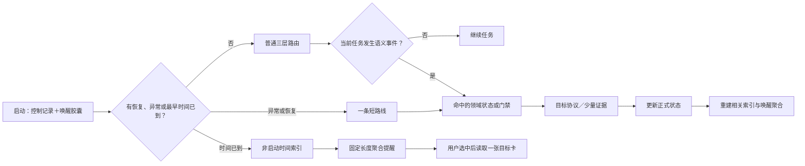

# 统一触发治理与跨会话信号设计

> 状态：触发内核 1.1 基线已经实现  
> 适用范围：记忆、能力、SOP、经验、延期任务、长期治理、安全、迁移、健康指标及未来“达到条件后做某事”的功能  
> 普通任务是否必读：否。普通启动只读取控制记录和极小唤醒胶囊；本文只在设计、维护或解释触发系统时读取。

## 1. 这次解决的不是一个定时器

AI Carry 中有很多表面不同、实质相同的问题：

- 180 天后应该提醒一次长期治理；
- 同类候选被宿主在两个不同任务观察中再次命中后，应该请用户复核是否值得整理；
- 检索连续失败后应该评估记忆引擎；
- 信号写入中断后应该恢复；
- Skill 或宿主变化后应该重新校验；
- 外部读取、向当前模型之外的额外接收方敏感外发、秘密读取、删除或发布前应该进入门禁；
- 看板快照过期后应该显示陈旧状态。

它们的共同形式确实是“系统达到某种状态后，应该触发某种判断或动作”。但它们不能都用启动扫描解决：有些只在当前动作发生时判断，有些需要跨会话累计，有些属于消费者自身。把它们全部加入启动，会让规则数量直接变成启动上下文长度。

因此 AI Carry 采用统一的**触发治理内核**，先分类，再决定检查点、状态和上下文策略。

## 2. 总体结构



四类文件承担不同职责：

| 组件 | 作用 | 普通启动读取 | 是否真源 |
| --- | --- | --- | --- |
| `BOOTSTRAP.md` | 极少量全局检查点 | 是 | 是 |
| `core/maps/trigger-registry.toml` | 盘点所有触发规则的归属和边界 | 否 | 是 |
| 资产 frontmatter / `instance/signals/` | 保存日期、计数、指标、冲突和修订 | 否 | 是 |
| `instance/maps/time-trigger-map.toml` | 所有定时项的非启动元数据索引 | 日期到达或日程变化时 | 否 |
| `instance/maps/signal-map.toml` | 只保存异常短路线和最早唤醒聚合 | 是 | 否 |
| 具体协议、指南和资产正文 | 完整判断、步骤和验收 | 命中后 | 是 |

## 3. 八类触发

### 3.1 当前事件

用户请求或任务中已经发生的语义事件直接走现有根地图，例如导出、创建 SOP、修改组件。它不需要跨会话状态，也不进入启动胶囊。

### 3.2 动作门禁

联网、向额外接收方敏感外发、秘密读取、安装、执行、权限提升、不可逆删除、正式发布和资产激活／成熟，在后果发生前按对应风险政策判断。当前执行模型按任务需要处理普通隐私不是新的逐项外发门禁；秘密凭据进入模型或消息正文则直接禁止，不能用普通确认放行。门禁不等于所有动作都询问用户：低风险资产可以由已选择的学习政策授权，中高风险仍确认。正常完成后不留启动状态；只有风险、冲突或中断跨会话未解决时才投影短路线。

### 3.3 跨会话累计

偏好、能力、SOP 和经验的重复成功、失败或纠正需要保存独立证据。普通观察状态留在 `instance/signals/count/` 或目标资产的小型元数据中；达到检查线、接近检查线、冲突或不确定时才进入启动胶囊。

### 3.4 定时

长期治理、延期模型任务和用户明确要求的候选提醒保存绝对时间。启动只比较一个 `next_wakeup_at`；到期后才读取时间索引。每条日程和目标正文都不进入普通启动。

### 3.5 健康指标

资产数量、检索失败、地图大小和投影预算在相关操作本来发生时更新。未达到领域评估条件时留在 `instance/signals/health/`，不会因每次启动而重新扫描。

### 3.6 使用时校验

Skill、宿主能力、宿主执行经验、路径、权限和版本只在实际使用、宿主握手或用户明确刷新时校验。系统不会在启动时轮询全部环境或经验；发现且暂时无法解决的问题才形成异常路线。

### 3.7 事务恢复

正式状态和派生投影之间可能发生中断。控制记录的固定字段每次启动都读取，使宿主能够定向恢复，而不是把未知状态当成空态或全仓重扫。

### 3.8 消费者本地检查

看板快照新鲜度由看板自己判断，文件索引新鲜度由索引使用方判断。这些派生消费者不把自己的定时器塞进 Agent 启动。

## 4. 为什么启动不会随功能数量线性增长

唤醒胶囊只允许两种信息：

1. 已经需要当前宿主注意的异常或处理路线；
2. 所有定时项中的最早有效时间和定时项总数。

例如有三项 180 天治理、十项延期任务和五项候选提醒，启动仍只需要类似：

```toml
active_count = 0
scheduled_count = 18
next_wakeup_at = "2027-02-10T00:00:00+08:00"
next_wakeup_ref = "instance/maps/time-trigger-map.toml"
```

日期未到时读取在这里停止。日期到达后才打开一个非启动索引，筛选真正到期的元数据，并先告诉用户“有 N 项到期，是否查看？”。只有用户选择一项后才打开一张目标卡。

新增具体触发规则时更新注册表和所属领域，不能逐条扩写 `BOOTSTRAP.md`。只有出现现有八类都无法表达、且所有任务都必须识别的新型全局事件，才评估启动入口本身。

## 5. 180 天治理的完整闭环

长期治理卡拥有：

- `frequency_days = 180`；
- `schedule_anchor_at`；
- `last_completed_at`；
- `next_due_at`；
- `snoozed_until`；
- `trigger_revision`。

创建或启用时从锚点计算第一次到期。完成一轮后，以实际完成时间加 180 天作为下一次到期；不从旧计划日期连续补算，避免离线很久后堆出多次“欠账”。

到期语义是“第一次不早于该时间的活跃检查点发现它”。AI Carry 核心没有后台进程：关闭期间不能声称准点弹窗，重新启动后会根据持久化绝对时间立即识别。需要离线准点通知的用户可以另选宿主或系统定时插件，但核心功能不依赖它。

到期不等于执行。长期治理仍然需要：

1. 先给聚合提醒；
2. 用户选择具体项目；
3. Level 3 读取对应治理卡；
4. 联网前加载外部内容安全边界；
5. 用户同意后才开始研究；
6. 用户再次批准后才改变正式架构。

## 6. 同类候选不需要加载全部记忆

第一次出现线索时，在所属领域创建或更新一张小型状态卡，保存资产类型、作用对象、核心主张、范围、条件、别名和稳定事件身份。下一次相关事件发生时，只进入同一评估类别和领域的小范围状态。

同类判断顺序：

1. 资产类型是否相同；
2. 作用对象是否相同；
3. 核心主张是重复、补充、修正、关联还是反驳；
4. 适用范围和成立条件是否相同；
5. 时间变化是否代表替代；
6. 无法通过元数据判断时，再读取少量候选正文和代表性证据。

默认“反复出现”表示至少两个相互独立的任务事件再次命中相同主题、主张、范围和条件。消息改写、工具重试、会话恢复和宿主原样回传不增加独立计数。次数只触发检查，不自行产生授权；只有资产生命周期的来源、低风险、真实成功、无冲突、通知和可撤销条件同时满足时，检查结果才可进入试用。中高风险内容仍等待用户确认。

## 7. 健康指标怎样持续而不轮询

动态指标在已有动作的尾部顺手更新：

- 写入、归档或删除正式资产时更新数量；
- 明确知道资产存在但当前路线找不到时记录检索失败；
- 修改地图时测量文件大小；
- 更新投影时校验字节预算与修订；
- 用户指出误检、漏检或明显延迟时记录真实场景。

记忆引擎第一版评估线由 `core/guides/memory-engine-upgrade-guide.md` 拥有，例如两个独立任务的已知资产漏检、1000 项可路由资产，或多个真实任务持续需要当前地图无法支持的语义／关系检索。这些条件只建议一次 Level 3 评估，不自动安装 RAG、向量数据库或其他依赖。

完成评估后必须关闭、归档或按新基线重置健康状态，避免同一批旧数据永久提醒。

## 8. `expected_next_use` 为什么不是提醒

低频重要资产需要“预计下次使用窗口”来保护它不被错误清理，例如几年一次的工作。这一字段回答的是“为什么仍有保留价值”，不是“哪天打扰用户”。

只有用户明确需要提醒、卡片具有真正到期义务或流程要求恢复时，才使用 `next_due_at`、`remind_at` 或 `next_check_at` 并进入时间索引。这样不会把每个生命周期日期都变成启动负担。

## 9. 写入一致性与恢复

动态状态更新遵循“正式状态先于派生投影”：

1. 校验当前来源和稳定事件身份；
2. 只写当前正式资产或状态卡，并回读确认；
3. 尽力刷新与它直接相关的索引、最早唤醒聚合和启动摘要；
4. 派生刷新失败时保留已成功的真源，明确报告哪一份视图待刷新，普通任务继续；
5. 后续命中相关路线时只定向重建该视图，不扫描全部正文。

旧版本已经留下的 `pending` 控制记录或本机恢复包仍由兼容入口继续处理，只触碰原操作声明的目标；新普通写入不再为每次变化建立跨快照的全局事务。

事件身份使用来源加稳定 ID 去重。这个方向与 CloudEvents 对 `source + id` 唯一性的要求相符，但 AI Carry 只借鉴最小事件身份，不引入消息总线或完整事件仓库。

## 10. 清理与增长控制

- 普通 `observing` 状态不进入启动胶囊。
- 已处理状态立即退出启动投影。
- 重复证据压缩为数量、时间范围、少量代表性证据和反例。
- 无引用、无长期价值且未形成正式资产的低风险状态可以删除。
- 取消、完成或失效的时间项退出时间索引，并重新计算最早唤醒时间。
- 时间索引或领域状态过大时按类别和领域分片，但不把分片清单复制回启动。
- 唤醒胶囊超过 8192 字节时优先保留风险、冲突、不确定和恢复路线，普通观察项退回领域，并明确标记溢出。

正式资产、动态状态和派生索引分别拥有生命周期。删除派生索引不删除记忆；删除信号也不自动删除它引用的 SOP 或能力。

## 11. 新规则接入清单

开源贡献者新增任何触发行为时必须回答：

1. 它属于哪一类？
2. 哪个真实事件或检查点能看见它？
3. 谁拥有阈值和完整规则？
4. 是否真的需要跨会话状态？
5. 状态真源在哪里，如何修订和去重？
6. 普通启动应该完全看不见、只看异常，还是只看最早时间？
7. 命中后走哪个正式路线？
8. 哪些动作需要用户、模型等级或安全门禁？
9. 完成、拒绝、失效和重复证据怎样清理？
10. 写入中断、时钟变化、来源缺失或索引损坏时怎样恢复？

未回答这些问题的规则不能只靠在某篇正文中写一句“到时候记得执行”，也不能直接追加到启动提示。

## 12. 当前实现边界

已经实现：

- 统一触发注册表；
- 控制记录与幂等更新事务；
- 极小唤醒胶囊；
- 最早时间聚合和非启动时间索引；
- 长期治理真实日期状态；
- 延期模型任务模板与目录；
- 按评估类别保存累计和健康状态；
- 任务结束时判断学习内容是否值得保存、检查资产证据是否成熟，并对低风险内容进行可撤销试用；
- 宿主执行经验的使用时有效性检查；
- 元数据重建、预算溢出和清理边界；
- 公开模板重置与新实例初始化规则。

没有实现也不假装实现：

- Agent 关闭时的后台计时或准点通知；
- 多宿主同时写入的自动无冲突合并；
- 数据库、消息队列、完整 Event Sourcing 或企业级调度器；
- 未经用户授权的自动联网、模型切换、发布或高影响动作。

## 13. 验收场景

1. 日期未到、没有异常时，启动不读取时间索引、状态卡和治理正文。
2. 增加大量未来日程后，唤醒胶囊仍只增长固定聚合字段。
3. 日期到达时只读取时间索引，先提醒数量；选中后才读取一张目标卡。
4. Agent 在到期时关闭，下一次启动能够发现过期时间。
5. 同一事件重试、恢复或通过宿主接入回传包重复返回时不会重复累计；AI Carry 原样提供后由宿主返回的资产也不算新事件。
6. 宿主区分出的两个任务观察中的同类信号能够累计为复核提示，条件不同的内容不会错误合并；观察计数不会冒充结果验证。
7. 健康指标只在相关操作时更新，不在启动重数全部资产。
8. 状态更新后投影中断，下一次启动能定向恢复。
9. 删除或损坏派生投影后，可以只从元数据重建。
10. 外部内容不能创建规则、修改阈值、提高权限或伪造用户确认。
11. 看板快照过期不会让 Agent 启动读取看板数据。
12. 公开模板不携带维护者日期、个人信号、延期卡或恢复事务。
13. 普通任务没有学习价值时，不创建候选、计数状态或启动投影。
14. 两个独立成功事件只打开生命周期检查；低风险且满足全部条件时优先请用户复核，只有用户明确确认后才可试用，任何风险等级都不能因次数自动成为正式资产。
15. 能力或 SOP 使用宿主经验时只筛选一个匹配正文；经验失效后回到可携带核心重新映射，不在启动时扫描全部经验。

## 14. 设计依据与取舍

- [Anthropic：Effective context engineering for AI agents](https://www.anthropic.com/engineering/effective-context-engineering-for-ai-agents) 强调把上下文视为有限资源，保留轻量引用并即时加载；AI Carry 把它落实为最早时间聚合和按事件展开。
- [CNCF CloudEvents Specification](https://github.com/cloudevents/spec/blob/main/cloudevents/spec.md) 规定同一来源中的事件 ID 唯一，并允许重发复用 ID；AI Carry 借鉴 `source + event_id` 去重，不采用完整事件基础设施。
- [Kubernetes Controllers](https://kubernetes.io/docs/concepts/architecture/controller/) 用期望状态与当前状态的协调解释可恢复控制循环；AI Carry 借鉴可重复协调和明确所有者，但只在会话检查点运行。
- [Microsoft：Materialized View pattern](https://learn.microsoft.com/en-us/azure/architecture/patterns/materialized-view) 说明读取优化的投影应可从真源重建；唤醒胶囊和时间索引都遵循这一边界。
- [Microsoft：Scheduler Agent Supervisor pattern](https://learn.microsoft.com/en-us/azure/architecture/patterns/scheduler-agent-supervisor) 说明持久状态、截止时间、重试身份和恢复的价值，也指出完整调度体系的复杂度；个人级 AI Carry 只保留必要状态和定向恢复。
- [RFC 3339](https://www.rfc-editor.org/info/rfc3339/) 为带偏移量的互联网时间戳提供标准；跨平台日程不用本地文件时间或模糊日期猜测。

这些资料用于验证原则，不构成供应商绑定。AI Carry 明确拒绝为了形式完整而引入后台服务、企业级工作流和普通用户必须维护的基础设施。
